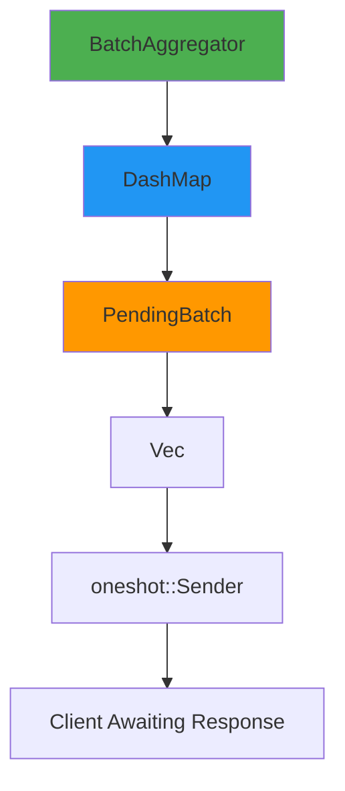

# Request Batching Guide

## Overview

Request batching is a powerful optimization feature in Only1MCP that aggregates multiple similar requests into a single backend call within a configurable time window. This dramatically reduces backend load and improves overall system efficiency, particularly for list operations that return the same data to multiple concurrent clients.

### Key Benefits

- **50-70% reduction** in backend calls for tools/list, resources/list, and prompts/list
- **Lower latency** for individual clients (amortized backend call cost)
- **Reduced context overhead** by eliminating duplicate requests
- **Improved backend server health** through reduced load
- **Lock-free concurrency** for high-performance batching under load

### Trade-offs

- **Added latency**: Requests wait 0-100ms (default) for batch window to close
- **Configuration complexity**: Requires tuning window_ms and max_batch_size
- **Limited scope**: Only supports list methods currently (not tools/call)

## Architecture

### How It Works

1. **Request Submission**: Client submits request (e.g., `tools/list` for `server1`)
2. **Batch Creation**: First request creates a new batch with a timeout timer
3. **Request Aggregation**: Subsequent similar requests join the same batch
4. **Batch Flushing**: Batch is processed when:
   - Timeout expires (default 100ms), OR
   - Max batch size reached (default 10 requests)
5. **Backend Call**: Single representative request sent to backend
6. **Response Distribution**: All waiting clients receive a clone of the response

### Batch Key

Batches are keyed by `(server_id, method)` tuple:

```rust
BatchKey {
    server_id: "filesystem_server",
    method: "tools/list",
}
```

Requests with different servers or methods are batched separately.

### Data Structures



**Components**:

- **BatchAggregator**: Main entry point, manages all batches
- **DashMap**: Concurrent hashmap for lock-free batch management
- **PendingBatch**: Collection of requests waiting to be processed
- **PendingRequest**: Individual request with oneshot channel for response
- **oneshot::Sender**: Tokio channel to send response back to waiting client

### Concurrency Model

- **Lock-free reads/writes**: DashMap allows concurrent batch access
- **Atomic batch creation**: First request creates batch, subsequent join atomically
- **Async timers**: Tokio spawn for timeout-based flush
- **Response cloning**: Same response distributed to all waiters (Error must be Clone)

## Configuration

### Full Configuration Example

```yaml
context_optimization:
  batching:
    # Enable/disable batching (default: false for backward compatibility)
    enabled: true

    # Time window in milliseconds to collect requests (default: 100ms)
    window_ms: 100

    # Maximum requests in batch before forcing flush (default: 10)
    max_batch_size: 10

    # Whitelist of methods that support batching
    methods:
      - tools/list
      - resources/list
      - prompts/list
```

### Configuration Fields

#### `enabled` (boolean, default: `false`)

Master switch for batching feature. When `false`, all requests bypass BatchAggregator and go directly to backends.

**Recommendation**: Start with `false`, monitor baseline performance, then enable and compare.

#### `window_ms` (u64, default: `100`)

Time window in milliseconds to collect requests before flushing.

**Trade-offs**:
- **Lower values** (20-50ms): Lower latency, less batching efficiency
- **Higher values** (100-200ms): Better batching, higher perceived latency

**Tuning Guide**:
- High-frequency clients: 50-100ms
- Low-frequency clients: 100-200ms
- Real-time systems: 20-50ms

#### `max_batch_size` (usize, default: `10`)

Maximum number of requests to batch before forcing immediate flush (regardless of timeout).

**Trade-offs**:
- **Lower values** (5-10): More frequent backend calls, lower memory usage
- **Higher values** (20-50): Better batching efficiency, higher memory usage

**Tuning Guide**:
- Average concurrent clients: Set to 2x expected concurrency
- High concurrency: 20-50
- Low concurrency: 5-10

#### `methods` (Vec<String>, default: `["tools/list", "resources/list", "prompts/list"]`)

Whitelist of MCP methods eligible for batching.

**Why only list methods**:
- List methods return complete datasets (no params needed)
- Response is identical for all clients
- Trivial to aggregate (just return same response)

**Not supported**:
- `tools/call`: Requires per-client parameters (tool arguments)
- `resources/read`: Requires per-client URI parameter
- `prompts/get`: Requires per-client prompt name parameter

## Supported Methods

### tools/list

**Request**:
```json
{
  "jsonrpc": "2.0",
  "id": 1,
  "method": "tools/list",
  "params": {}
}
```

**Why batchable**: No parameters, returns complete tool list for server.

**Efficiency**: 5 concurrent requests → 1 backend call (80% reduction)

### resources/list

**Request**:
```json
{
  "jsonrpc": "2.0",
  "id": 2,
  "method": "resources/list",
  "params": {}
}
```

**Why batchable**: No parameters, returns complete resource list for server.

**Efficiency**: Similar to tools/list

### prompts/list

**Request**:
```json
{
  "jsonrpc": "2.0",
  "id": 3,
  "method": "prompts/list",
  "params": {}
}
```

**Why batchable**: No parameters, returns complete prompt list for server.

**Efficiency**: Similar to tools/list

## Metrics and Monitoring

### Prometheus Metrics

#### `batching_requests_total` (Counter)

Total number of requests routed through BatchAggregator.

**Labels**: None

**Usage**:
```promql
rate(batching_requests_total[5m])
```

Monitors batching throughput over time.

#### `batching_batch_size` (Histogram)

Distribution of batch sizes (how many requests per batch).

**Buckets**: 1, 2, 3, 5, 10, 20, 50

**Usage**:
```promql
histogram_quantile(0.95, batching_batch_size_bucket)
```

Shows 95th percentile batch size. Higher is better (more efficient).

#### `batching_wait_time_seconds` (Histogram)

Time requests spend waiting in batch before processing.

**Buckets**: 0.01, 0.05, 0.1, 0.2, 0.5, 1.0

**Usage**:
```promql
histogram_quantile(0.99, batching_wait_time_seconds_bucket)
```

Shows 99th percentile wait time. Should be ≤ window_ms.

#### `batching_efficiency_ratio` (Gauge)

Current batching efficiency (1.0 / batch_size).

**Values**: 0.0 to 1.0 (lower is better)
- 1.0 = No batching (1 request/batch)
- 0.1 = 10 requests/batch (90% reduction)
- 0.05 = 20 requests/batch (95% reduction)

**Usage**:
```promql
1 - batching_efficiency_ratio
```

Shows percentage of backend calls saved.

### Grafana Dashboard Example

```json
{
  "title": "Request Batching",
  "panels": [
    {
      "title": "Batching Throughput",
      "targets": [{
        "expr": "rate(batching_requests_total[5m])"
      }]
    },
    {
      "title": "Batch Size Distribution",
      "targets": [{
        "expr": "histogram_quantile(0.5, batching_batch_size_bucket)",
        "legendFormat": "p50"
      }, {
        "expr": "histogram_quantile(0.95, batching_batch_size_bucket)",
        "legendFormat": "p95"
      }]
    },
    {
      "title": "Backend Call Reduction",
      "targets": [{
        "expr": "(1 - batching_efficiency_ratio) * 100"
      }]
    },
    {
      "title": "Wait Time Latency",
      "targets": [{
        "expr": "histogram_quantile(0.99, batching_wait_time_seconds_bucket) * 1000"
      }]
    }
  ]
}
```

## Performance Tuning

### Scenario 1: High-Frequency Clients

**Problem**: Many clients rapidly requesting tools/list every second

**Configuration**:
```yaml
context_optimization:
  batching:
    enabled: true
    window_ms: 50      # Shorter window for lower latency
    max_batch_size: 20  # Larger batch for high concurrency
    methods:
      - tools/list
```

**Expected Results**:
- Batch size: 10-20 requests/batch
- Wait time: 30-50ms
- Backend reduction: 90-95%

### Scenario 2: Low-Frequency Clients

**Problem**: Occasional tools/list requests from background tasks

**Configuration**:
```yaml
context_optimization:
  batching:
    enabled: true
    window_ms: 200     # Longer window to capture sparse requests
    max_batch_size: 5   # Smaller batch (unlikely to fill)
    methods:
      - tools/list
```

**Expected Results**:
- Batch size: 2-5 requests/batch
- Wait time: 100-200ms
- Backend reduction: 50-80%

### Scenario 3: Real-Time Systems

**Problem**: WebSocket clients need immediate responses

**Configuration**:
```yaml
context_optimization:
  batching:
    enabled: true
    window_ms: 20      # Very short window
    max_batch_size: 3   # Small batch, rely on concurrency
    methods:
      - tools/list
```

**Expected Results**:
- Batch size: 1-3 requests/batch
- Wait time: 10-20ms
- Backend reduction: 33-66%

### Scenario 4: Backend is Slow

**Problem**: Backend takes 500ms to respond to tools/list

**Configuration**:
```yaml
context_optimization:
  batching:
    enabled: true
    window_ms: 100     # Standard window
    max_batch_size: 50  # Very large batch
    methods:
      - tools/list
```

**Rationale**: With 500ms backend latency, 100ms batching latency is negligible (20% overhead). Maximize batching to reduce backend calls.

**Expected Results**:
- Batch size: 30-50 requests/batch
- Wait time: 50-100ms
- Total latency: 550-600ms (vs 500ms without batching)
- Backend reduction: 96-98%

## Edge Cases

### Single Request in Batch

**Scenario**: Only one request arrives within window_ms.

**Behavior**: Batch waits full window_ms, then processes single request.

**Impact**: Added latency of window_ms with no batching benefit.

**Mitigation**: Set lower window_ms for low-traffic scenarios.

### Error Handling

**Scenario**: Backend returns error for batched request.

**Behavior**: Error is cloned and distributed to all waiting clients.

**Example**:
```rust
// Backend returns error
Err(Error::Server("Backend down".to_string()))

// All 10 clients in batch receive:
Err(Error::Server("Backend down".to_string()))
```

**Note**: Error enum must implement Clone (achieved via String conversion).

### Concurrent Submissions

**Scenario**: 100 clients submit tools/list simultaneously.

**Behavior**:
- First request creates batch
- Next 9 requests join batch (max_batch_size=10)
- Batch 1 flushes immediately
- Requests 11-20 create batch 2
- etc.

**Result**: 10 batches of 10 requests each.

### Different Servers

**Scenario**: Requests to server1 and server2 arrive simultaneously.

**Behavior**: Separate batches created (different BatchKey).

**Example**:
```rust
BatchKey { server_id: "server1", method: "tools/list" }  // Batch 1
BatchKey { server_id: "server2", method: "tools/list" }  // Batch 2
```

### Channel Closed

**Scenario**: Client disconnects before batch processes.

**Behavior**: oneshot::Sender send fails silently (receiver dropped).

**Impact**: No crash, other clients in batch unaffected.

## Future Work

### Protocol-Level Batching (tools/call)

**Challenge**: tools/call has per-client parameters (tool name, arguments).

**Proposed Solution**: Extend MCP protocol to support batch tool calls:

```json
{
  "jsonrpc": "2.0",
  "id": "batch-1",
  "method": "tools/batch_call",
  "params": {
    "calls": [
      { "name": "get_weather", "arguments": { "location": "NYC" } },
      { "name": "get_weather", "arguments": { "location": "LA" } },
      { "name": "search_web", "arguments": { "query": "rust" } }
    ]
  }
}
```

**Backend Returns**:
```json
{
  "jsonrpc": "2.0",
  "id": "batch-1",
  "result": {
    "results": [
      { "output": "72F sunny in NYC" },
      { "output": "85F sunny in LA" },
      { "output": "[search results...]" }
    ]
  }
}
```

**Benefits**:
- Single HTTP request for multiple tool calls
- Reduced connection overhead
- Better backend amortization

**Status**: Requires MCP protocol extension (not yet standardized).

### Adaptive Batching

**Idea**: Automatically adjust window_ms based on traffic patterns.

**Algorithm**:
```rust
if avg_batch_size < 2 {
    // Not enough concurrency, reduce latency
    window_ms *= 0.8;
} else if avg_batch_size > max_batch_size * 0.8 {
    // High concurrency, increase window
    window_ms *= 1.2;
}
```

**Benefits**:
- No manual tuning required
- Adapts to changing load patterns
- Balances latency vs efficiency automatically

**Status**: Planned for Phase 3.

### Per-Server Batching Config

**Idea**: Different window_ms for different servers.

**Example**:
```yaml
servers:
  - id: fast_server
    batching:
      window_ms: 20  # Low latency backend
  - id: slow_server
    batching:
      window_ms: 200  # High latency backend
```

**Benefits**:
- Optimize per backend characteristics
- Slow backends can batch more aggressively
- Fast backends can batch less

**Status**: Future consideration.

## Examples

### Basic Usage

```rust
use only1mcp::batching::BatchAggregator;
use only1mcp::config::BatchingConfig;
use only1mcp::types::McpRequest;

#[tokio::main]
async fn main() {
    let config = BatchingConfig {
        enabled: true,
        window_ms: 100,
        max_batch_size: 10,
        methods: vec!["tools/list".to_string()],
    };

    let aggregator = BatchAggregator::new(config)
        .with_backend_caller(|server_id, request| {
            // Your backend communication logic here
            send_to_backend(server_id, request).await
        });

    // Submit request
    let request = McpRequest::new("tools/list", json!({}), Some(json!(1)));
    let response = aggregator
        .submit_request("server1".to_string(), request)
        .await
        .unwrap();

    println!("Response: {:?}", response);
}
```

### Custom Backend Caller

```rust
// Example: HTTP backend with retry logic
let aggregator = BatchAggregator::new(config).with_backend_caller(
    |server_id: String, request: McpRequest| {
        // Find server URL from config
        let url = get_server_url(&server_id)?;

        // Retry logic
        let mut attempts = 0;
        loop {
            match http_client.post(&url).json(&request).send().await {
                Ok(response) => return response.json().await,
                Err(e) if attempts < 3 => {
                    attempts += 1;
                    tokio::time::sleep(Duration::from_millis(100)).await;
                },
                Err(e) => return Err(Error::Transport(e.to_string())),
            }
        }
    }
);
```

### Monitoring Active Batches

```rust
// Check how many batches are currently pending
let active = aggregator.active_batch_count();
println!("Active batches: {}", active);

// Clear all pending batches (e.g., during shutdown)
aggregator.clear().await;
```

## Troubleshooting

### High Latency

**Symptom**: Requests taking longer than expected.

**Diagnosis**:
```promql
histogram_quantile(0.99, batching_wait_time_seconds_bucket)
```

If result ≈ window_ms, batching is waiting full timeout.

**Solution**: Reduce window_ms or increase traffic to fill batches faster.

### Low Batching Efficiency

**Symptom**: Backend call reduction < 50%.

**Diagnosis**:
```promql
histogram_quantile(0.5, batching_batch_size_bucket)
```

If result < 2, not enough concurrent requests.

**Solution**:
- Increase window_ms to capture more requests
- Check if traffic is actually concurrent
- Consider disabling batching for this workload

### Memory Growth

**Symptom**: Process memory increasing over time.

**Diagnosis**: Check active_batch_count() periodically.

If growing without bound, batches aren't flushing.

**Solution**:
- Ensure backend_caller is set correctly
- Check for hung backend calls
- Review logs for errors

### Uneven Batch Sizes

**Symptom**: Some batches have 1 request, others have max_batch_size.

**Diagnosis**: Traffic is bursty, not uniform.

**Solution**:
- Accept variability (normal for real workloads)
- Use adaptive batching (future)
- Focus on average efficiency, not individual batches

## Conclusion

Request batching is a powerful optimization that can reduce backend calls by 50-70% for list operations. Proper configuration and monitoring ensure optimal performance without sacrificing latency. Start with conservative settings (enabled: false), measure baseline, then enable and tune based on your specific workload.

**Key Takeaways**:
- Batching trades latency for efficiency
- Only works for list methods (tools/list, resources/list, prompts/list)
- Requires tuning window_ms and max_batch_size
- Monitor with Prometheus metrics
- Future protocol extensions will enable tools/call batching

---

**References**:
- [Only1MCP Architecture](./ARCHITECTURE.md)
- [Configuration Guide](./configuration.md)
- [Metrics and Observability](./metrics.md)
- [MCP Protocol Specification](../ref_docs/01-MCP_SDK_Specification.md)
