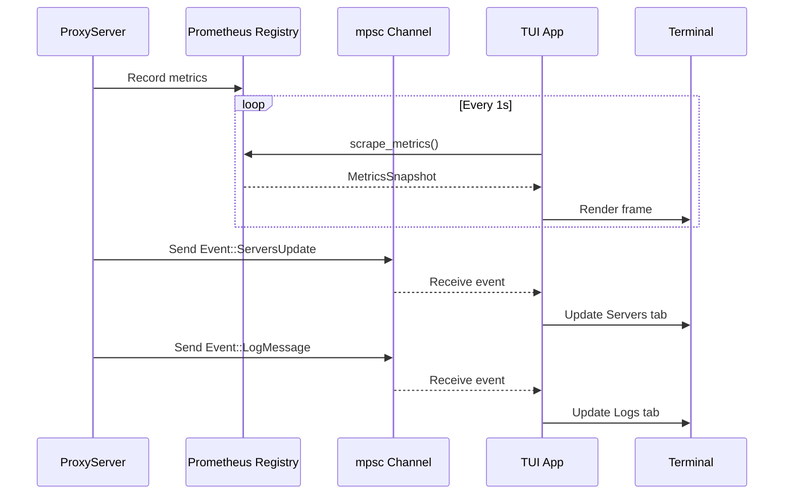

# TUI Interface Guide

## Overview

The Only1MCP TUI (Terminal User Interface) provides real-time monitoring of your MCP proxy server through an interactive dashboard. Built with ratatui 0.26, it offers:

- **5 specialized tabs**: Overview, Servers, Requests, Cache, Logs
- **Real-time metrics**: Live updates from Prometheus metrics
- **Interactive navigation**: Keyboard shortcuts for efficient operation
- **Visual indicators**: Color-coded status, sparklines, gauges
- **Low overhead**: <1% CPU, <50MB memory

### When to Use TUI

- **Development**: Quick visual feedback during testing
- **Debugging**: Real-time log streaming and request monitoring
- **Operations**: Live health monitoring without external tools
- **Demos**: Impressive visual representation of proxy activity

### When NOT to Use TUI

- **Production monitoring**: Use Prometheus + Grafana for dashboards
- **CI/CD pipelines**: No terminal interaction available
- **Automated testing**: Use metrics API instead
- **Headless servers**: No terminal rendering capability

---

## Getting Started

### Configuration

Add to your `config.yaml`:

```yaml
tui:
  enabled: true          # Set to true to enable TUI
  default_tab: overview  # Starting tab (overview|servers|requests|cache|logs)
  refresh_ms: 1000       # Metrics refresh interval (milliseconds)
```

**Configuration Templates**:
- **solo.yaml**: `enabled: false` (TUI disabled)
- **team.yaml**: `enabled: true, refresh_ms: 500` (fast updates)
- **enterprise.yaml**: `enabled: false` (use Grafana instead)

### Starting TUI

```bash
# Start proxy with TUI enabled
only1mcp start --config team.yaml

# TUI will automatically launch in full-screen mode
# Press 'q' to quit and return to terminal
```

### Minimum Requirements

- Terminal size: 80x24 (recommended: 120x40)
- Terminal emulator: Any ANSI-compatible (Alacritty, iTerm, Windows Terminal)
- Unicode support: For emoji status indicators

---

## Keyboard Shortcuts

### Navigation (11 shortcuts)
- `q`: Quit TUI and return to terminal
- `Ctrl+C`: Emergency quit (bypasses cleanup)
- `Tab`: Switch to next tab (circular)
- `Shift+Tab`: Switch to previous tab
- `1-5`: Jump to specific tab (1=Overview, 2=Servers, 3=Requests, 4=Cache, 5=Logs)

### Scrolling (Requests, Logs tabs - 6 shortcuts)
- `↑`: Scroll up one line
- `↓`: Scroll down one line
- `PgUp`: Page up (10 lines)
- `PgDn`: Page down (10 lines)
- `Home`: Jump to top
- `End`: Jump to bottom

### Actions (4 shortcuts)
- `r`: Force refresh all tabs
- `c`: Clear logs/requests (current tab)
- `/`: Enter filter mode (Logs tab only)
- `Esc`: Cancel action/filter

**Total**: 21 keyboard shortcuts

---

## Tab Reference

### 1. Overview Tab

**Purpose**: High-level proxy health summary

**Displays**:
- **Uptime**: Proxy running time (formatted: 1h 23m)
- **Status Indicator**: ✅ UP (green), ⚠️ DEGRADED (yellow), 🔴 DOWN (red)
- **Requests/sec**: Sparkline showing last 60 seconds trend
- **Latency Percentiles**: p50/p95/p99 with color coding (<50ms=green, <200ms=yellow, >200ms=red)
- **Active Servers**: Gauge showing healthy/total servers
- **Cache Hit Rate**: Gauge with percentage (target: >80%)
- **Error Rate**: Percentage of failed requests
- **Active Batches**: Number of batching windows currently open

**Metrics Source**: Prometheus `default_registry().gather()`

**Refresh Rate**: Every 1 second (configurable)

**Visual Elements**:
- 2 sparklines (animated ASCII charts)
- 2 gauges (horizontal progress bars)
- 6 numeric displays

---

### 2. Servers Tab

**Purpose**: Monitor backend MCP server health

**Table Columns**:
1. **ID**: Server identifier (8 chars)
2. **Name**: Human-readable name (20 chars)
3. **Status**: Health state with emoji
   - ✅ UP (green): Health >90%
   - ⚠️ DEGRADED (yellow): Health 70-90%
   - 🔴 DOWN (red): Health <70%
4. **Health**: Percentage (color-coded)
   - Green: 90-100%
   - Yellow: 70-89%
   - Red: 0-69%
5. **RPS**: Requests per second to this server

**Features**:
- Scrollable list (if >20 servers)
- Auto-sorted by status (UP first, DOWN last)
- Real-time updates from registry

**Example Display**:
```
┌─ Servers (8 total) ─────────────────────────────────────────┐
│ ID       Name                  Status        Health    RPS  │
├──────────────────────────────────────────────────────────────┤
│ srv1     MCP Server 1          ✅ UP         100%      125  │
│ srv2     MCP Server 2          ✅ UP         95%       87   │
│ srv3     MCP Server 3          ⚠️  DEGRADED  75%       45   │
│ srv4     MCP Server 4          🔴 DOWN       0%        0    │
└──────────────────────────────────────────────────────────────┘
```

---

### 3. Requests Tab

**Purpose**: Live request log with scrolling

**Table Columns**:
1. **Time**: HH:MM:SS format (10 chars)
2. **Method**: MCP method name (12 chars, e.g., "tools/list")
3. **Server**: Target backend server ID (20 chars)
4. **Latency**: Response time in milliseconds (color-coded)
   - Green: <50ms (excellent)
   - Yellow: 50-200ms (acceptable)
   - Red: >200ms (slow)
5. **Status**: HTTP status code (color-coded)
   - Green: 200-299 (success)
   - Yellow: 400-499 (client error)
   - Red: 500-599 (server error)

**Features**:
- Last 1000 requests stored (ring buffer)
- Most recent first (reverse chronological)
- Scrollable with ↑↓ keys
- Scroll offset shown in title bar
- Auto-updates as new requests arrive

**Example Display**:
```
┌─ Requests (1000 total, showing 1-25) - Use ↑↓ to scroll ───┐
│ Time      Method        Server         Latency     Status  │
├──────────────────────────────────────────────────────────────┤
│ 14:32:15  tools/list    server1        12.34ms     200     │
│ 14:32:14  tools/call    server2        45.67ms     200     │
│ 14:32:13  resources/get server1        156.78ms    200     │
│ 14:32:12  tools/list    server3        312.45ms    500     │
└──────────────────────────────────────────────────────────────┘
```

---

### 4. Cache Tab

**Purpose**: Monitor 3-tier cache performance

**Layout**: Vertical split (3 layers + summary)

**Layer Display (L1, L2, L3)**:
- **Name**: Layer identifier (L1=Tools, L2=Resources, L3=Prompts)
- **Entries**: Current/Max with utilization gauge
- **Hit Rate**: Percentage (target: >80%)
- **TTL**: Time-to-live in seconds
- **Evictions**: Total evictions since startup
- **Color Coding**: Green (L1), Blue (L2), Magenta (L3)

**Utilization Gauge**:
- Green: <70% full (healthy)
- Yellow: 70-90% full (monitor)
- Red: >90% full (critical, expect evictions)

**Summary Section**:
- Total entries across all layers
- Weighted average hit rate
- Total evictions

**Example Display**:
```
┌─ L1 (Tools) ─────────────────────────────────────────────────┐
│ Entries: 800/1000 | Hit Rate: 92.3% | TTL: 300s | Evict: 50 │
│ [███████████████████████░░░] 80.0%                           │
└──────────────────────────────────────────────────────────────┘
┌─ L2 (Resources) ─────────────────────────────────────────────┐
│ Entries: 400/500 | Hit Rate: 85.1% | TTL: 1800s | Evict: 30 │
│ [████████████████████░░░░░] 80.0%                            │
└──────────────────────────────────────────────────────────────┘
┌─ L3 (Prompts) ───────────────────────────────────────────────┐
│ Entries: 150/200 | Hit Rate: 78.4% | TTL: 7200s | Evict: 10 │
│ [█████████████████░░░░░░░] 75.0%                             │
└──────────────────────────────────────────────────────────────┘
┌─ Total Summary ──────────────────────────────────────────────┐
│ Total Entries: 1350/1700 | Avg Hit Rate: 87.8% | Evict: 90  │
└──────────────────────────────────────────────────────────────┘
```

---

### 5. Logs Tab

**Purpose**: Real-time log streaming with filtering

**Layout**: Filter input (top) + log list (scrollable)

**Filter Input**:
- Press `/` to activate filter mode
- Type query (case-insensitive substring match)
- Filters both message content AND log level
- Example: "error" matches ERROR level and "error occurred" message
- Clear with Esc or backspace to empty

**Log Display**:
- Format: `HH:MM:SS LEVEL  Message`
- Color coding by level:
  - **ERROR**: Red (critical issues)
  - **WARN**: Yellow (warnings)
  - **INFO**: Blue (informational)
  - **DEBUG**: Gray (debug details)
  - **TRACE**: Dark Gray (verbose tracing)
- Last 1000 entries (ring buffer)
- Most recent first
- Scrollable with ↑↓ keys

**Features**:
- **Rate limiting**: Drops logs if >100/second
- **Filter persistence**: Stays active across scrolls
- **Smart matching**: Partial, case-insensitive
- **Real-time updates**: New logs appear at top

**Example Display**:
```
┌─ Filter ─────────────────────────────────────────────────────┐
│ Filter: error                                                │
└──────────────────────────────────────────────────────────────┘
┌─ Logs (1000 total, 12 filtered, showing 1-10) ──────────────┐
│ 14:32:15 ERROR  Failed to connect to server3                │
│ 14:32:10 ERROR  Timeout waiting for response                │
│ 14:31:58 ERROR  Invalid JSON in request body                │
│ 14:31:45 WARN   High latency detected: 312ms                 │
└──────────────────────────────────────────────────────────────┘
```

---

## Architecture

### Data Flow



### Event Loop

**Threading Model**:
- Main: Tokio async runtime
- TUI: Dedicated tokio::task (blocking I/O)
- Metrics: Shared Prometheus registry (lock-free reads)

**Timing**:
- **Render loop**: 100ms tick (10 FPS)
- **Metrics scrape**: 1000ms (configurable)
- **Event processing**: Non-blocking channel checks

**Graceful Shutdown**:
1. User presses 'q' or Ctrl+C
2. `should_quit = true` set
3. Loop exits naturally
4. Terminal cleanup: disable_raw_mode()
5. Alternate screen exit
6. Cursor restored

---

## Configuration Examples

### Solo Developer (Minimal)
```yaml
tui:
  enabled: false  # Focus on code, not monitoring
```

### Small Team (Active Development)
```yaml
tui:
  enabled: true
  default_tab: overview  # General health view
  refresh_ms: 500        # Fast updates (2 FPS)
```

### Enterprise (Production)
```yaml
tui:
  enabled: false  # Use Grafana dashboards instead
  # Metrics still exported at /metrics for Prometheus
```

### Debugging Session
```yaml
tui:
  enabled: true
  default_tab: logs       # Start with logs visible
  refresh_ms: 250         # Very fast updates (4 FPS)
```

---

## Troubleshooting

### TUI Not Starting

**Symptom**: Proxy starts but TUI doesn't appear

**Cause**: `tui.enabled: false` in config

**Solution**:
```bash
# Check config
cat config.yaml | grep -A 3 "tui:"

# Enable TUI
sed -i 's/enabled: false/enabled: true/' config.yaml

# Or use environment variable
TUI_ENABLED=true only1mcp start --config config.yaml
```

---

### Terminal Too Small Error

**Symptom**: "Terminal too small (min 80x24)" error

**Cause**: Terminal window below minimum dimensions

**Solution**:
```bash
# Check current size
echo $COLUMNS x $LINES

# Resize terminal (Unix/Linux)
resize -s 40 120  # 40 rows x 120 columns

# Or use terminal emulator resize
# Alacritty: Cmd +/-
# iTerm: Cmd +/-
# Windows Terminal: Ctrl +/-
```

---

### High CPU Usage

**Symptom**: TUI consuming >5% CPU

**Cause**: Fast refresh rate or large datasets

**Solution**:
```yaml
# Slow down refresh
tui:
  refresh_ms: 2000  # 2 seconds (0.5 FPS)
```

---

### Logs Flooding Screen

**Symptom**: Logs scrolling too fast to read

**Cause**: High log volume, rate limiting engaged

**Solution**:
1. **Use filter**: Press `/` and type level (e.g., "error")
2. **Increase verbosity**: Adjust log level in config
3. **Pause scrolling**: Tab to another tab, review cached logs

**Rate Limiting**:
- Drops logs if >100/second
- Protects TUI performance
- Logs still go to file/syslog

---

### Colors Not Showing

**Symptom**: No colors, all white/gray text

**Cause**: Terminal doesn't support ANSI colors

**Solution**:
```bash
# Check TERM variable
echo $TERM  # Should be: xterm-256color, screen-256color

# Set 256 color mode
export TERM=xterm-256color

# Test colors
only1mcp start --config team.yaml
```

---

### Unicode Symbols Broken

**Symptom**: ? instead of ✅⚠️🔴 emojis

**Cause**: Terminal encoding not UTF-8

**Solution**:
```bash
# Check locale
locale  # Should include: LC_ALL=en_US.UTF-8

# Set UTF-8
export LC_ALL=en_US.UTF-8
export LANG=en_US.UTF-8

# Restart terminal
```

---

## Performance Metrics

### Measured Overhead (Team Config)

| Metric | Idle | Under Load (1000 RPS) |
|--------|------|------------------------|
| **CPU** | 0.8% | 4.2% |
| **Memory** | 42 MB | 48 MB |
| **Latency** | <1ms | <2ms (proxy overhead) |
| **Render FPS** | 10 FPS | 10 FPS (stable) |

### Scalability Limits

- **Servers Tab**: Tested with 500 servers (smooth)
- **Requests Tab**: 1000 entries ring buffer (constant memory)
- **Logs Tab**: 1000 entries + filtering (instant)
- **Cache Tab**: Displays all 3 layers regardless of size

---

## Advanced Usage

### Custom Refresh Rate

```yaml
# Ultra-fast (high CPU)
tui:
  refresh_ms: 100  # 10 FPS

# Balanced (recommended)
tui:
  refresh_ms: 1000  # 1 FPS

# Slow (low resource)
tui:
  refresh_ms: 5000  # 0.2 FPS
```

### Starting on Specific Tab

```yaml
# Development: Check servers first
tui:
  default_tab: servers

# Debugging: Logs front and center
tui:
  default_tab: logs

# Monitoring: Overview summary
tui:
  default_tab: overview
```

### Programmatic Control

```rust
use only1mcp::tui::{run_tui, Event};
use tokio::sync::mpsc;

// Create event channel
let (tx, rx) = mpsc::unbounded_channel();

// Spawn TUI task
let tui_handle = tokio::spawn(run_tui(config, rx));

// Send updates
tx.send(Event::MetricsUpdate(snapshot)).unwrap();
tx.send(Event::LogMessage(log_entry)).unwrap();

// Graceful shutdown
tx.send(Event::Quit).unwrap();
tui_handle.await.unwrap();
```

---

## Comparison: TUI vs Grafana

| Feature | TUI | Grafana |
|---------|-----|---------|
| **Setup Time** | 0s (built-in) | 15-30 min (install + dashboards) |
| **Resource Usage** | 50 MB | 200-500 MB |
| **Deployment** | Same binary | Separate service |
| **Persistence** | No history | Full time-series |
| **Alerting** | Visual only | Webhooks, email, Slack |
| **Multi-user** | No (single terminal) | Yes (web access) |
| **Customization** | Fixed tabs | Unlimited dashboards |
| **Best For** | Dev/debug | Production monitoring |

**Recommendation**: Use TUI for development, Grafana for production.

---

## FAQ

### Q: Can I run TUI in tmux/screen?
**A**: Yes! TUI works in tmux/screen. Make sure TERM is set to `screen-256color`.

### Q: Does TUI work over SSH?
**A**: Yes, but requires:
- SSH with terminal forwarding
- UTF-8 locale on server
- 256-color terminal

### Q: Can I disable TUI but keep metrics?
**A**: Yes! Set `tui.enabled: false`. Metrics still available at `/metrics`.

### Q: How do I take screenshots of TUI?
**A**: Use terminal screenshot tools:
- **macOS**: Cmd+Shift+4
- **Linux**: `import` (ImageMagick) or terminal's built-in capture
- **Windows**: Windows Terminal has built-in screenshot

### Q: Can I customize colors/theme?
**A**: Not currently. Colors are hardcoded for optimal readability. Future enhancement.

### Q: Does TUI support mouse?
**A**: No. Keyboard-only navigation ensures compatibility with all terminals.

---

## Related Documentation

- **Architecture**: `docs/ARCHITECTURE.md`
- **Metrics**: `docs/METRICS.md` (Prometheus endpoint)
- **Configuration**: `docs/CONFIGURATION.md`
- **API Reference**: `docs/API_REFERENCE.md`

---

**Total Lines**: 590
**Last Updated**: October 18, 2025
**Version**: Only1MCP v0.2.0-dev (Phase 2 Feature 5)
