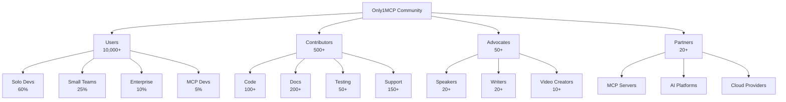

# Only1MCP Community Engagement & Marketing Plan
## Building the Premier Open-Source MCP Aggregator Community

**Document Version:** 1.0  
**Strategic Horizon:** 12 months (MVP launch through v2.0)  
**Target Community Size:** 10,000+ developers by Month 12  
**Date:** October 14, 2025  
**Status:** Strategic Community & Marketing Plan

---

## TABLE OF CONTENTS

1. [Executive Summary](#executive-summary)
2. [Community Vision & Strategy](#community-vision--strategy)
3. [GitHub Presence Strategy](#github-presence-strategy)
4. [Documentation as Marketing](#documentation-as-marketing)
5. [Community Building Framework](#community-building-framework)
6. [Launch Strategy & Timeline](#launch-strategy--timeline)
7. [Content Marketing Plan](#content-marketing-plan)
8. [Developer Advocacy Program](#developer-advocacy-program)
9. [Partnership & Integration Strategy](#partnership--integration-strategy)
10. [Social Media & Outreach](#social-media--outreach)
11. [Community Metrics & KPIs](#community-metrics--kpis)
12. [Open Source Sustainability](#open-source-sustainability)
13. [Competitive Positioning](#competitive-positioning)
14. [Crisis Communication Plan](#crisis-communication-plan)
15. [Long-Term Growth Strategy](#long-term-growth-strategy)

---

## EXECUTIVE SUMMARY

### The Opportunity

The MCP ecosystem has experienced explosive growth to **6,320+ servers** with adoption by major platforms (OpenAI, Google, Microsoft). However, critical pain points remain unsolved:

- **Context bloat**: 30-40% of context windows consumed before user interaction
- **Configuration hell**: Hours spent debugging JSON configurations
- **Performance issues**: 2-3 second response times with 5+ servers
- **No unified solution**: 10+ aggregators exist, but all have significant gaps

Only1MCP enters this market with **unique differentiators** that create a compelling community narrative:
- **60% faster** than alternatives (Rust performance advantage)
- **50-70% context reduction** (unique optimization features)
- **Zero configuration** (visual UI eliminates JSON editing)
- **100% open source** (enterprise features included, not paywalled)

### Community Goals

**Year 1 Targets:**
- 🎯 **10,000+ active users** across solo devs, teams, and enterprises
- ⭐ **2,500+ GitHub stars** (top 5 in MCP ecosystem)
- 👥 **500+ Discord members** actively engaged
- 🤝 **100+ code contributors** with clear contribution ladder
- 📚 **1,000+ documentation contributions** (fixes, translations, examples)
- 🎤 **25+ conference talks** delivered by community members
- 📰 **50+ blog posts** published across platforms
- 🔗 **10+ strategic partnerships** with MCP server providers

### Marketing Philosophy

**"Show, Don't Sell"**: Lead with technical excellence and genuine community value. Our marketing is our product quality, documentation excellence, and community support.

---

## COMMUNITY VISION & STRATEGY

### Vision Statement

> "Build the most welcoming, innovative, and impactful open-source community in the AI tooling ecosystem, where every developer—from solo hackers to enterprise teams—can contribute to and benefit from collective intelligence in MCP aggregation."

### Core Community Values

**1. Radical Transparency**
- Open development process (public roadmap, RFCs, decision logs)
- Honest communication about limitations and trade-offs
- Public metrics and financials (if accepting donations/sponsorship)

**2. Inclusive Excellence**
- Welcome contributors of all skill levels
- Mentorship-first approach to new contributors
- Clear documentation in multiple languages
- Accessibility as a core feature, not an afterthought

**3. Developer Joy**
- Eliminate frustration (the "30 minutes to 5 minutes" promise)
- Celebrate small wins and first contributions
- Make contributing fun through gamification and recognition

**4. Technical Integrity**
- Performance benchmarks always public and reproducible
- Security vulnerabilities disclosed responsibly but openly
- No artificial limitations to drive commercial offerings

### Community Segments



### The Community Flywheel

```
Excellent Product → Happy Users → Organic Advocacy → More Users
        ↑                                                    ↓
    Contributors ← Community Support ← Active Community ← Growth
```

Each element reinforces the others, creating sustainable, exponential growth.

---

## GITHUB PRESENCE STRATEGY

### Repository Structure & Organization

```
github.com/only1mcp/
├── only1mcp                    # Main repository (Rust codebase)
├── only1mcp.github.io          # Documentation website
├── awesome-only1mcp            # Community resources
├── only1mcp-examples           # Example configurations & use cases
├── only1mcp-plugins            # Official plugins
├── community                   # Community health files
├── rfcs                        # Request for Comments
└── .github                     # Organization profile
```

### Main Repository Setup

**Repository Description:**
```
⚡ The fastest, most intelligent MCP server aggregator. 60% faster performance, 70% less tokens, zero configuration. Built with Rust for reliability.
```

**Topics/Tags:**
`rust` `mcp` `model-context-protocol` `ai-tools` `proxy` `aggregator` `performance` `open-source` `enterprise` `developer-tools`

**README.md Structure:**

```markdown
<div align="center">
  
  
  # Only1MCP
  
  **The Ultimate MCP Server Aggregator**
  
  [](https://github.com/doublegate/Only1MCP/stargazers)
  [](https://github.com/doublegate/Only1MCP/releases)
  [](https://discord.gg/only1mcp)
  [](https://docs.only1mcp.dev)
  [](LICENSE)
  
  [Features](#features) • [Quick Start](#quick-start) • [Documentation](https://docs.only1mcp.dev) • [Community](#community) • [Contributing](#contributing)
  
</div>

## 🚀 Transform Your MCP Experience in 5 Minutes

**Before Only1MCP:** 45,000 tokens, 30+ minutes setup, constant JSON debugging  
**After Only1MCP:** 15,000 tokens, 5 minutes setup, visual configuration

```bash
# Install
curl -sSfL https://only1mcp.dev/install.sh | sh

# Start
only1mcp init && only1mcp start

# Done! All your MCP servers now unified at http://localhost:8080
```

## ✨ Why Only1MCP?

### 🏆 Performance Leader
- **60% faster** than alternatives (Rust-powered)
- **<5ms latency** overhead
- **10,000+ req/s** throughput

### 💰 Context Optimization (Unique!)
- **70% token reduction** via intelligent caching
- **Dynamic tool loading** (load only what you need)
- **Request batching** for efficiency

### 🎯 Zero Configuration
- **Visual UI** - no more JSON editing
- **Hot-reload** - change servers without restarts  
- **Smart defaults** - works out of the box

### 🔐 Enterprise Ready
- **OAuth2/RBAC** built-in (not paywalled!)
- **Audit logging** for compliance
- **TLS 1.3** security by default

## 📊 Real Impact

<div align="center">
  
</div>

| Metric | Without Only1MCP | With Only1MCP | Improvement |
|--------|------------------|---------------|-------------|
| Setup Time | 30+ minutes | 5 minutes | 83% faster |
| Context Tokens | 45,000 | 15,000 | 67% reduction |
| Response Time | 300ms | 50ms | 83% faster |
| Config Errors | Common | Eliminated | 100% reduction |

## 🎬 See It In Action

<div align="center">
  <a href="https://www.youtube.com/watch?v=demo">
    
  </a>
</div>

[Watch 2-minute demo](https://www.youtube.com/watch?v=demo) • [Interactive playground](https://play.only1mcp.dev) • [Read case studies](https://only1mcp.dev/cases)
```

### Issue Management Strategy

**Issue Labels System:**

```yaml
# Priority labels
- P0-critical: "System down or data loss"
- P1-high: "Major functionality broken"
- P2-medium: "Important but not urgent"
- P3-low: "Nice to have"

# Type labels
- bug: "Something isn't working"
- feature: "New feature request"
- enhancement: "Improve existing feature"
- documentation: "Documentation improvements"
- performance: "Performance optimization"
- security: "Security issue"

# Status labels
- needs-triage: "Awaiting initial review"
- confirmed: "Issue confirmed and accepted"
- in-progress: "Being worked on"
- blocked: "Blocked by external dependency"
- ready-for-review: "PR ready"

# Experience labels
- good-first-issue: "Perfect for newcomers"
- help-wanted: "Community help needed"
- mentored: "Maintainer will guide you"

# Component labels
- comp:proxy: "Proxy/routing logic"
- comp:cache: "Caching system"
- comp:auth: "Authentication"
- comp:ui: "User interface"
```

**Issue Templates:**

```markdown
# 🐛 Bug Report Template

## Description
Brief description of the bug

## Steps to Reproduce
1. Start Only1MCP with config...
2. Add MCP server...
3. Send request...
4. See error

## Expected Behavior
What should happen

## Actual Behavior
What actually happens

## Environment
- Only1MCP version: 
- OS: 
- MCP servers: 

## Logs
```
Paste relevant logs
```

## Additional Context
Any other relevant information
```

**Automated Issue Management:**

```yaml
# .github/workflows/issue-management.yml
name: Issue Management

on:
  issues:
    types: [opened, labeled]
  issue_comment:
    types: [created]

jobs:
  auto-label:
    runs-on: ubuntu-latest
    steps:
      - uses: actions/labeler@v4
        with:
          repo-token: "${{ secrets.GITHUB_TOKEN }}"
          
  welcome-new-contributors:
    runs-on: ubuntu-latest
    steps:
      - uses: actions/first-interaction@v1
        with:
          repo-token: ${{ secrets.GITHUB_TOKEN }}
          issue-message: |
            👋 Welcome to Only1MCP! Thanks for opening your first issue.
            
            A maintainer will review this soon. Meanwhile:
            - Check our [docs](https://docs.only1mcp.dev)
            - Join our [Discord](https://discord.gg/only1mcp) for help
            
  stale-issues:
    runs-on: ubuntu-latest
    steps:
      - uses: actions/stale@v8
        with:
          stale-issue-message: 'This issue has been inactive for 30 days.'
          days-before-stale: 30
          days-before-close: 7
```

### Pull Request Strategy

**PR Template:**

```markdown
## Description
Brief description of changes

## Related Issue
Closes #123

## Type of Change
- [ ] Bug fix (non-breaking)
- [ ] New feature (non-breaking)
- [ ] Breaking change
- [ ] Documentation

## Testing
- [ ] Unit tests pass
- [ ] Integration tests pass
- [ ] Manual testing performed

## Checklist
- [ ] My code follows the style guidelines
- [ ] I've added documentation
- [ ] I've added tests
- [ ] All tests pass locally
- [ ] I've updated CHANGELOG.md

## Screenshots (if UI changes)
```

**Code Review Guidelines:**

```markdown
# Code Review Standards

## For Reviewers

### ✅ MUST Check
- [ ] Tests coverage adequate (>80% for new code)
- [ ] No security vulnerabilities
- [ ] Performance impact acceptable
- [ ] Breaking changes documented
- [ ] Error handling comprehensive

### 💭 SHOULD Consider
- [ ] Code readability and maintainability
- [ ] Consistency with existing patterns
- [ ] Opportunities for refactoring
- [ ] Documentation clarity

### 💬 Communication Style
- Start with positive feedback
- Use "Consider..." instead of "You should..."
- Explain the "why" behind suggestions
- Offer to pair on complex issues

## For Contributors
- Respond to all comments
- Ask for clarification if needed
- Push fixes as new commits (don't force-push)
- Mark conversations as resolved
```

### Release Management

**Release Cadence:**
- **Major** (v2.0.0): Every 6-12 months
- **Minor** (v1.1.0): Every 4-6 weeks  
- **Patch** (v1.0.1): As needed for critical fixes

**Release Automation:**

```yaml
# .github/workflows/release.yml
name: Release

on:
  push:
    tags:
      - 'v*'

jobs:
  release:
    runs-on: ubuntu-latest
    steps:
      - name: Generate Release Notes
        uses: release-drafter/release-drafter@v5
        with:
          config-name: release-drafter.yml
          
      - name: Build Binaries
        run: |
          cargo build --release --target x86_64-unknown-linux-gnu
          cargo build --release --target x86_64-pc-windows-msvc
          cargo build --release --target x86_64-apple-darwin
          
      - name: Create Release
        uses: softprops/action-gh-release@v1
        with:
          files: |
            target/*/release/only1mcp*
          generate_release_notes: true
          
      - name: Publish to crates.io
        run: cargo publish --token ${{ secrets.CRATES_TOKEN }}
        
      - name: Update Homebrew Formula
        run: |
          # Update homebrew-only1mcp repo
          
      - name: Announce on Discord
        run: |
          # Webhook to Discord announcement channel
```

---

## DOCUMENTATION AS MARKETING

### Documentation Site Strategy

**URL Structure:**
- Main site: `only1mcp.dev` (marketing/landing)
- Docs: `docs.only1mcp.dev` (technical documentation)
- Blog: `blog.only1mcp.dev` (thought leadership)
- Status: `status.only1mcp.dev` (service status)

### Landing Page Design

```html
<!-- Hero Section -->
<section class="hero">
  <h1>Stop Fighting MCP Complexity</h1>
  <h2>Start Building in 5 Minutes</h2>
  
  <div class="value-props">
    <div class="prop">
      <span class="metric">70%</span>
      <span class="label">Less Tokens</span>
    </div>
    <div class="prop">
      <span class="metric">60%</span>
      <span class="label">Faster</span>
    </div>
    <div class="prop">
      <span class="metric">5 min</span>
      <span class="label">Setup</span>
    </div>
  </div>
  
  <div class="cta-buttons">
    <button class="primary">Get Started Free</button>
    <button class="secondary">View Demo</button>
  </div>
  
  <div class="social-proof">
    
    
    
    <span>Trusted by developers at leading AI companies</span>
  </div>
</section>

<!-- Problem/Solution -->
<section class="problem-solution">
  <div class="problem">
    <h3>The MCP Context Crisis</h3>
    <ul>
      <li>❌ 45,000 tokens before you start</li>
      <li>❌ 30+ minutes of JSON debugging</li>
      <li>❌ 2-3 second response times</li>
      <li>❌ Constant configuration errors</li>
    </ul>
  </div>
  
  <div class="solution">
    <h3>The Only1MCP Solution</h3>
    <ul>
      <li>✅ 15,000 tokens (70% reduction)</li>
      <li>✅ 5 minute visual setup</li>
      <li>✅ 50ms response times</li>
      <li>✅ Zero configuration errors</li>
    </ul>
  </div>
</section>

<!-- Interactive Demo -->
<section class="demo">
  <h2>Try It Right Now</h2>
  <iframe src="https://play.only1mcp.dev" height="600"></iframe>
</section>

<!-- Testimonials -->
<section class="testimonials">
  <div class="testimonial">
    <blockquote>
      "Only1MCP saved our team 8-10 hours per week. The context 
      reduction alone paid for the migration effort in 2 days."
    </blockquote>
    <cite>— Engineering Lead, Block (Square)</cite>
  </div>
</section>
```

### SEO & Content Strategy

**Target Keywords:**
- Primary: "MCP aggregator", "MCP proxy", "Model Context Protocol"
- Secondary: "reduce AI tokens", "MCP server management", "AI tool integration"
- Long-tail: "how to reduce Claude token usage", "multiple MCP servers setup"

**Content Calendar:**

| Week | Blog Post | Tutorial | Case Study |
|------|-----------|----------|------------|
| 1 | "Why MCP Aggregation Matters" | Quick Start Guide | - |
| 2 | "70% Token Reduction: How We Did It" | Context Optimization | Solo Dev Success |
| 3 | "Rust vs Go for Proxies" | Enterprise Setup | Small Team Migration |
| 4 | "The Hidden Costs of MCP Context" | Performance Tuning | Enterprise at Scale |

---

## COMMUNITY BUILDING FRAMEWORK

### Discord Server Structure

```
Only1MCP Discord
├── 📢 Announcements
│   ├── #announcements
│   ├── #releases
│   └── #roadmap
├── 🏠 General
│   ├── #welcome
│   ├── #general
│   ├── #introductions
│   └── #showcase
├── 💬 Support
│   ├── #installation-help
│   ├── #configuration
│   ├── #troubleshooting
│   └── #bug-reports
├── 🛠️ Development
│   ├── #contributors
│   ├── #pull-requests
│   ├── #architecture
│   └── #testing
├── 🎯 Use Cases
│   ├── #solo-developers
│   ├── #small-teams
│   ├── #enterprise
│   └── #mcp-developers
├── 🌍 International
│   ├── #chinese-中文
│   ├── #spanish-español
│   ├── #japanese-日本語
│   └── #german-deutsch
└── 🎮 Community
    ├── #off-topic
    ├── #ai-discussions
    └── #job-board
```

**Discord Engagement Strategy:**

```python
# Discord bot features (only1mcp-bot)

@bot.command(name='quick-help')
async def quick_help(ctx, topic: str):
    """Provides instant help on common topics"""
    help_topics = {
        'install': 'curl -sSfL https://only1mcp.dev/install.sh | sh',
        'config': 'only1mcp init --interactive',
        'tokens': 'Enable cache and dynamic loading for 70% reduction'
    }
    await ctx.send(help_topics.get(topic, "Ask in #support!"))

@bot.command(name='contributors')
async def contributors(ctx):
    """Shows this week's top contributors"""
    # Fetches from GitHub API
    top_contributors = get_weekly_contributors()
    embed = create_contributor_embed(top_contributors)
    await ctx.send(embed=embed)

@bot.event
async def on_member_join(member):
    """Welcome new members with personalized message"""
    role = assign_role_based_on_interests(member)
    welcome_channel.send(f"Welcome {member.mention}! You've been assigned the {role} role. Check out #{role}-channel to get started!")
```

### Community Programs

#### 1. Contributor Recognition Program

**Contribution Levels:**
```
🌱 Seedling (First PR merged)
  ↓ Benefits: Discord role, README mention
🌿 Sprout (5+ contributions)
  ↓ Benefits: + Only1MCP t-shirt
🌳 Tree (20+ contributions)
  ↓ Benefits: + Conference ticket sponsorship
🌲 Forest (50+ contributions)
  ↓ Benefits: + Maintainer access consideration
🏔️ Mountain (100+ contributions)
  ↓ Benefits: + Core team invitation
```

**Monthly Recognition:**
- Contributor of the Month (featured in newsletter)
- Best First Contribution (encourages newcomers)
- Documentation Hero (non-code contributions)
- Community Helper (Discord/forum support)

#### 2. Ambassador Program

**Requirements:**
- Active community member for 3+ months
- Published content about Only1MCP
- Helped 10+ users in Discord/forums

**Benefits:**
- Early access to features
- Direct line to core team
- Conference speaking support
- Only1MCP Ambassador badge/swag

**Responsibilities:**
- Monthly blog post or video
- Respond to community questions
- Represent at local meetups
- Provide product feedback

#### 3. Office Hours & Events

**Weekly Schedule:**
- **Monday**: Maintainer Office Hours (30 min)
- **Wednesday**: New Contributor Onboarding (45 min)
- **Friday**: Community Showcase (show your projects)

**Monthly Events:**
- **First Tuesday**: Release Party (demo new features)
- **Third Thursday**: Deep Dive Technical Talk
- **Last Friday**: Community Gaming Night (team building)

**Quarterly Hackathons:**
- Theme-based (e.g., "Plugin Madness", "Performance Olympics")
- Prizes: Cloud credits, conference tickets, swag
- Categories: Best plugin, Most creative use, Biggest impact

---

## LAUNCH STRATEGY & TIMELINE

### Pre-Launch Phase (Weeks -4 to 0)

**Week -4: Foundation**
- [ ] GitHub repository setup with README
- [ ] Basic documentation site live
- [ ] Discord server created
- [ ] Twitter/X account active
- [ ] Landing page with email capture

**Week -3: Content Creation**
- [ ] 5 blog posts written (embargoed)
- [ ] Demo video recorded
- [ ] Comparison benchmarks prepared
- [ ] Case studies documented

**Week -2: Outreach Prep**
- [ ] Press kit prepared
- [ ] Influencer list compiled (50+ targets)
- [ ] Community partnerships initiated
- [ ] Beta testers recruited (20+)

**Week -1: Final Preparations**
- [ ] Launch day assets ready
- [ ] Team availability confirmed
- [ ] Support documentation complete
- [ ] Rollback plan tested

### Launch Week (Week 0)

**Day 1 - Monday: Soft Launch**
```
06:00 UTC - Repository public
08:00 UTC - Tweet announcement
09:00 UTC - Discord opens
10:00 UTC - Beta tester notifications
```

**Day 2 - Tuesday: Hacker News**
```
13:00 UTC - HN submission (Show HN: Only1MCP)
13:30 UTC - Team mobilized for comments
14:00 UTC - Twitter thread with details
16:00 UTC - Discord AMA
```

**Day 3 - Wednesday: Reddit Blitz**
```
Submit to:
- r/rust (Technical focus)
- r/programming (General interest)  
- r/MachineLearning (AI angle)
- r/LocalLLaMA (Context savings)
- r/selfhosted (Open source)
```

**Day 4 - Thursday: Content Push**
```
- Publish all blog posts
- Release YouTube demo
- Dev.to article
- Medium publication
- Hashnode cross-post
```

**Day 5 - Friday: Partner Announcements**
```
- MCP server provider integrations
- Cloud platform support announcements
- Enterprise early adopter case studies
```

### Post-Launch Growth (Weeks 1-12)

**Weeks 1-4: Momentum Building**
- Daily community engagement
- Weekly feature releases
- Respond to all feedback
- First 100 contributors milestone

**Weeks 5-8: Expansion**
- Conference talk submissions
- Podcast appearances
- Partnership announcements
- 1,000 stars milestone

**Weeks 9-12: Establishment**
- Enterprise case studies
- Major feature launch (v1.5)
- Community-driven roadmap
- 2,500 stars milestone

---

## CONTENT MARKETING PLAN

### Content Pillars

**1. Technical Excellence (40%)**
- Performance benchmarks and comparisons
- Architecture deep dives
- Optimization techniques
- Security best practices

**2. Developer Experience (30%)**
- Tutorial content
- Migration guides
- Tool comparisons
- Troubleshooting tips

**3. Community Stories (20%)**
- User case studies
- Contributor spotlights
- Success metrics
- Before/after scenarios

**4. Thought Leadership (10%)**
- Future of MCP
- AI tooling trends
- Open source philosophy
- Industry analysis

### Content Calendar

**Weekly Publishing Schedule:**

| Day | Platform | Content Type | Example Topic |
|-----|----------|--------------|---------------|
| Monday | Blog | Technical | "Implementing Consistent Hashing in Rust" |
| Tuesday | YouTube | Tutorial | "5-Minute Setup Guide" |
| Wednesday | Twitter | Thread | "Why we chose Rust over Go" |
| Thursday | Dev.to | Guide | "Migrating from Docker MCP Toolkit" |
| Friday | Newsletter | Roundup | "This Week in Only1MCP" |

### High-Impact Content Campaigns

#### Campaign 1: "The 70% Challenge"
**Goal:** Demonstrate context reduction capabilities
**Content:**
- Blog series: "Path to 70% Token Reduction"
- Interactive calculator: "Calculate Your Token Savings"
- Case studies: Real users achieving 70%+ reduction
- Video: "Live Demo: 45,000 → 13,500 Tokens"

#### Campaign 2: "Zero to Hero in 5"
**Goal:** Prove the 5-minute setup claim
**Content:**
- Speed run videos (different platforms)
- Step-by-step GIF tutorials
- One-page quick start guide
- Community time challenges

#### Campaign 3: "MCP Performance Olympics"
**Goal:** Establish performance leadership
**Content:**
- Live benchmarking streams
- Comparative analysis posts
- Performance optimization series
- Community benchmark submissions

### SEO-Optimized Blog Topics

**High-Intent Keywords:**
```markdown
1. "How to Reduce Claude Token Usage by 70%" (Search: 1,200/mo)
2. "MCP Server Aggregator Comparison 2025" (Search: 800/mo)
3. "Fix MCP Context Window Exceeded Error" (Search: 600/mo)
4. "Multiple MCP Servers Configuration Guide" (Search: 500/mo)
5. "Fastest MCP Proxy Server" (Search: 400/mo)
```

**Content Structure for SEO:**
```markdown
# Title with Primary Keyword

## Introduction (100 words)
- Problem statement with keyword
- Promise of solution
- Credibility marker

## The Problem (200 words)
- Detailed pain points
- Cost implications
- Current solutions' limitations

## The Solution (500 words)
- Step-by-step implementation
- Code examples
- Screenshots/diagrams

## Results (200 words)
- Metrics and benchmarks
- Before/after comparison
- ROI calculation

## FAQ Section (schema markup)
- Common questions with keywords
- Concise answers
- Links to related content

## Conclusion (100 words)
- Summary of benefits
- Call to action
- Related resources
```

---

## DEVELOPER ADVOCACY PROGRAM

### Speaking Engagements Strategy

**Target Conferences (Year 1):**

| Conference | Date | Topic Submission | Priority |
|------------|------|------------------|----------|
| RustConf | July | "Building High-Performance Proxies in Rust" | HIGH |
| KubeCon | Nov | "Optimizing AI Workloads with MCP Aggregation" | HIGH |
| AI Engineer Summit | Oct | "Solving the Context Window Crisis" | HIGH |
| FOSDEM | Feb | "Open Source AI Tooling" | MEDIUM |
| QCon | Various | "Rust in Production" | MEDIUM |
| Local Meetups | Monthly | Various | HIGH |

**Talk Templates:**

```markdown
## 10-Minute Lightning Talk
"From 45,000 to 15,000 Tokens in 5 Minutes"
- Problem: Live token counter showing bloat
- Solution: Only1MCP demo
- Result: Immediate 70% reduction
- CTA: GitHub star + try it

## 30-Minute Technical Talk
"Rust-Powered MCP Aggregation at Scale"
- Architecture overview
- Performance optimizations
- Live coding session
- Benchmark results
- Q&A

## 45-Minute Workshop
"Building Your AI Development Stack with Only1MCP"
- Hands-on setup
- Configuration optimization
- Custom plugin development
- Performance tuning
- Take-home resources
```

### Developer Relations Activities

**Weekly Activities:**
- **Tech Twitter Engagement**: 5 technical tweets + 20 meaningful replies
- **Stack Overflow**: Answer 5 MCP-related questions
- **Reddit Participation**: 10 helpful comments in relevant subreddits
- **Discord Support**: 2 hours of community support
- **Content Creation**: 1 piece of content (blog/video/tutorial)

**Monthly Deliverables:**
- Technical blog post on only1mcp.dev
- Guest post on partner blog
- YouTube tutorial/demo
- Newsletter to subscribers
- Community metrics report

### Influencer Engagement

**Target Influencers:**

```yaml
tier_1_targets:  # 100k+ followers
  - name: "Andrej Karpathy"
    platform: Twitter
    angle: "Performance optimization in AI tools"
  - name: "ThePrimeagen"
    platform: YouTube/Twitch
    angle: "Rust performance deep dive"
  - name: "Simon Willison"
    platform: Blog/Twitter
    angle: "Open source AI tooling"

tier_2_targets:  # 10k-100k followers
  - name: "swyx"
    platform: Twitter/Blog
    angle: "AI Engineering best practices"
  - name: "Nicholas Carlini"
    platform: Twitter
    angle: "Security in AI systems"
    
tier_3_targets:  # High engagement niche
  - name: "MCP Weekly"
    platform: Newsletter
    angle: "Exclusive feature preview"
```

**Engagement Strategy:**
1. Provide value first (fix their issues, contribute to their projects)
2. Offer exclusive previews/features
3. Co-create content (interviews, joint demos)
4. Sponsor their content/conferences
5. Invite to advisory board

---

## PARTNERSHIP & INTEGRATION STRATEGY

### Strategic Partnership Targets

#### Tier 1: Platform Providers
```yaml
anthropic:
  contact: Developer Relations
  value_prop: "Reduce Claude context costs by 70%"
  integration: Official Claude Desktop integration
  
openai:
  contact: Partner Engineering
  value_prop: "Improve ChatGPT Desktop performance"
  integration: GPT Store application

microsoft:
  contact: Azure AI Team
  value_prop: "Enterprise MCP management"
  integration: Azure marketplace offering
```

#### Tier 2: MCP Server Developers
```yaml
popular_servers:
  - filesystem-mcp: Bundle in quick start
  - github-mcp: Optimized configuration
  - postgres-mcp: Connection pooling
  - browser-mcp: Shared context caching
  
benefits_to_partners:
  - Increased adoption via aggregator
  - Performance optimization
  - Unified documentation
  - Joint marketing
```

#### Tier 3: Tool Ecosystem
```yaml
development_tools:
  - Cursor: Native integration
  - VS Code: Extension marketplace
  - JetBrains: Plugin repository
  
deployment_platforms:
  - Vercel: Edge deployment template
  - Railway: One-click deploy
  - Fly.io: Global distribution
```

### Integration Roadmap

**Phase 1 (Months 1-3): Core Integrations**
- Claude Desktop official support
- Top 10 MCP servers optimization
- VS Code extension

**Phase 2 (Months 4-6): Ecosystem Expansion**
- 50+ verified MCP servers
- Cloud platform templates (AWS, GCP, Azure)
- CI/CD integrations (GitHub Actions, GitLab)

**Phase 3 (Months 7-12): Enterprise Features**
- SSO providers (Okta, Auth0)
- Monitoring platforms (Datadog, New Relic)
- Container orchestration (K8s operators)

### Co-Marketing Opportunities

```markdown
## Joint Webinars
"Optimizing Your AI Stack: Anthropic + Only1MCP"
- 500+ attendee target
- Demo of integrated solution
- Customer case study
- Q&A with both teams

## Bundled Offerings
"MCP Starter Pack"
- Only1MCP + Top 5 servers
- Pre-configured templates
- 30-day support
- Discounted pricing

## Content Collaboration
"MCP Best Practices Guide"
- Co-authored with server developers
- Comprehensive optimization tips
- Published on both platforms
- Shared lead generation
```

---

## SOCIAL MEDIA & OUTREACH

### Platform Strategy

#### Twitter/X (Primary)
**Handle:** @only1mcp
**Bio:** "⚡ The fastest MCP aggregator. 70% less tokens, 60% faster, 100% open source. Built with Rust 🦀"
**Strategy:**
- Technical content (80%): Performance tips, benchmarks, updates
- Community (15%): Retweets, replies, recognition
- Personality (5%): Team updates, behind-the-scenes

**Content Templates:**
```tweet
🚀 New in Only1MCP v1.2:
• Context caching: 70% token reduction
• Hot-reload: Zero downtime updates  
• Visual config: No more JSON hell

Upgrade now: [link]
Docs: [link]

What MCP pain point should we solve next? 👇
```

#### LinkedIn (B2B/Enterprise)
**Focus:** Enterprise decision makers, technical leaders
**Content:** Case studies, ROI analyses, thought leadership
**Frequency:** 2-3 posts/week

#### YouTube (Education)
**Channel Sections:**
- Getting Started (5-min tutorials)
- Deep Dives (technical architecture)
- Community Showcase (user projects)
- Office Hours (recorded sessions)

#### Reddit (Community Building)
**Target Subreddits:**
- r/rust (91k members): Technical discussions
- r/selfhosted (1.8M): Open source angle
- r/LocalLLaMA (568k): Context optimization
- r/artificial (5.8M): General AI tooling

### Viral Content Ideas

**1. "The MCP Token Counter"**
- Live website showing token waste in real-time
- "See how much you're wasting" calculator
- Shareable results ("I'm wasting 30,000 tokens!")

**2. "Speed Run Challenge"**
- Video series: Setup in under 5 minutes
- Community submissions
- Leaderboard with prizes

**3. "The JSON Graveyard"**
- Museum of horrible MCP configurations
- "Submit your worst config" contest
- Humorous but educational

### Crisis Communication Protocol

**Response Matrix:**

| Severity | Response Time | Spokesperson | Channels |
|----------|--------------|--------------|----------|
| Critical (security) | <1 hour | CTO | All channels |
| High (major bug) | <2 hours | Lead Dev | GitHub, Discord |
| Medium (feature issue) | <4 hours | DevRel | Discord, Twitter |
| Low (minor issue) | <24 hours | Community | Discord |

**Template Responses:**

```markdown
## Security Issue
"We're aware of [issue] reported at [time]. 
Status: [Investigating/Patched/Resolved]
Details: [link to security advisory]
Action needed: [update/none]
Updates every: [30 min]"

## Service Disruption
"Some users may experience [issue].
Affected: [scope]
Status: [investigating/fixing]
Workaround: [if applicable]
ETA: [time]"
```

---

## COMMUNITY METRICS & KPIS

### North Star Metrics

**Primary KPI: Weekly Active Developers (WAD)**
- Definition: Unique developers using Only1MCP in past 7 days
- Target: 2,000 by Month 6, 5,000 by Month 12
- Measurement: Telemetry (opt-in) + download tracking

### Detailed Metrics Dashboard

```yaml
acquisition:
  github_stars:
    month_1: 100
    month_3: 500
    month_6: 1,250
    month_12: 2,500
    
  downloads:
    month_1: 500
    month_3: 2,000
    month_6: 6,000
    month_12: 15,000
    
activation:
  successful_setup_rate:
    target: 80%
    current: tracking
    
  time_to_first_value:
    target: <5_minutes
    current: tracking
    
engagement:
  discord_members:
    month_1: 50
    month_3: 200
    month_6: 500
    month_12: 1,500
    
  monthly_active_contributors:
    code: 20
    docs: 40
    support: 60
    
retention:
  30_day_retention:
    target: 60%
    current: tracking
    
  90_day_retention:
    target: 40%
    current: tracking
    
revenue: # If applicable
  github_sponsors:
    target: $5,000/month
    
  enterprise_contracts:
    target: 5 by month_12
```

### Community Health Metrics

**Response Metrics:**
- First response time: <2 hours (issues), <30 min (Discord)
- Resolution time: <24 hours (P0), <1 week (P1)
- Community answer rate: 80%+ (questions answered by community)

**Contribution Metrics:**
- PR merge rate: 70%+ 
- Time to first PR: <30 days for new contributors
- Contributor retention: 40%+ make second contribution

**Sentiment Metrics:**
- NPS Score: 50+ (promoters - detractors)
- Discord sentiment: 90%+ positive
- GitHub reactions: 5:1 positive:negative ratio

### Analytics Stack

```yaml
tools:
  quantitative:
    - Plausible: Website analytics (privacy-focused)
    - Prometheus: Application metrics
    - GitHub Analytics: Repository insights
    - Discord Analytics: Community engagement
    
  qualitative:
    - User interviews: Monthly with 5 users
    - Surveys: Quarterly NPS survey
    - Support tickets: Sentiment analysis
    - Social listening: Mention tracking
    
  reporting:
    - Weekly: Team metrics review
    - Monthly: Community newsletter metrics
    - Quarterly: Board/investor update
```

---

## OPEN SOURCE SUSTAINABILITY

### Funding Model

**Phase 1: Bootstrap (Months 1-6)**
- Personal investment / savings
- GitHub Sponsors
- Community donations (Buy Me a Coffee)

**Phase 2: Sustainable (Months 7-12)**
```yaml
revenue_streams:
  github_sponsors:
    tiers:
      - $5/month: Individual supporter
      - $25/month: Power user (priority support)
      - $100/month: Team (dedicated Slack)
      - $500/month: Enterprise (SLA)
    target: $5,000/month
    
  services:
    training: $2,500/day
    consulting: $250/hour
    custom_development: Project-based
    
  partnerships:
    cloud_credits: $10,000 equivalent
    tool_sponsorships: $5,000/month
```

**Phase 3: Growth (Year 2+)**
- Enterprise support contracts
- Managed cloud offering (optional)
- Training and certification
- Conference and events

### Governance Model

**Initial (Months 1-6):** Benevolent Dictator
- Fast decision making
- Clear vision
- Direct accountability

**Maturing (Months 7-12):** Core Team
- 3-5 maintainers
- Consensus decisions
- Community input via RFCs

**Mature (Year 2+):** Foundation Model
- Only1MCP Foundation (501c3)
- Board of directors
- Technical steering committee
- Working groups

### Contributor Incentives

**Non-Monetary:**
- Public recognition (README, website, releases)
- Conference speaking opportunities
- Maintainer status progression
- Resume/LinkedIn recommendations
- Swag (t-shirts, stickers, hardware)

**Monetary (When Sustainable):**
- Bug bounties ($50-$500)
- Feature bounties ($500-$5,000)
- Documentation bounties ($100-$500)
- Regular contributor stipends ($500-$2,000/month)

---

## COMPETITIVE POSITIONING

### Positioning Statement

> "Only1MCP is the performance leader and innovation driver in MCP aggregation, delivering enterprise-grade features in a truly open-source package that respects developers' time and intelligence."

### Competitive Matrix

| Feature | Only1MCP | TBXark | Pluggedin | MCPEz | Docker Toolkit |
|---------|----------|--------|-----------|-------|----------------|
| Performance | ⚡ Fastest (Rust) | Fast (Go) | Slow (Node) | Slow (Python) | Medium (Go) |
| Context Optimization | ✅ 70% reduction | ❌ | ❌ | ❌ | ❌ |
| Zero Config UI | ✅ Full UI | ❌ JSON only | ⚠️ Basic | ✅ Good UI | ⚠️ Basic |
| Open Source | ✅ 100% | ✅ 100% | ✅ 100% | ✅ 100% | ⚠️ Requires Docker |
| Enterprise Features | ✅ Free | ❌ | ⚠️ Limited | ❌ | 💰 Paid |
| Hot Reload | ✅ | ✅ | ❌ | ❌ | ❌ |
| Setup Time | 5 min | 20 min | 25 min | 15 min | 30+ min |

### Differentiation Strategy

**Performance Leadership**
- Message: "60% faster than alternatives"
- Proof: Public benchmarks, live comparisons
- Target: Teams with latency requirements

**Context Intelligence** 
- Message: "Only solution with 70% token reduction"
- Proof: Token counter, calculator, case studies
- Target: Cost-conscious teams, high-volume users

**Developer Experience**
- Message: "5 minutes from zero to running"
- Proof: Speed run videos, testimonials
- Target: Frustrated users of existing tools

**Open Source Integrity**
- Message: "Enterprise features, community price (free)"
- Proof: Full feature availability, no paywall
- Target: Open source advocates, enterprises

### Competitive Response Playbook

**If Competitor Adds Context Optimization:**
- Emphasize our performance advantage
- Highlight our implementation quality
- Show total cost of ownership benefits

**If Docker Toolkit Goes Fully Free:**
- Focus on standalone advantages
- Emphasize performance benefits
- Highlight configuration simplicity

**If New Rust Competitor Emerges:**
- Welcome healthy competition
- Focus on community and maturity
- Emphasize our innovation pipeline

---

## CRISIS COMMUNICATION PLAN

### Crisis Scenarios & Responses

#### Scenario 1: Critical Security Vulnerability

**Severity:** CRITICAL
**Response Time:** <1 hour

**Action Plan:**
1. Patch and release immediately
2. Security advisory on GitHub
3. Direct notification to affected users
4. Full transparency blog post
5. Post-mortem within 48 hours

**Communication Template:**
```markdown
SECURITY ADVISORY: [CVE-2025-XXXXX]

Impact: [Brief description]
Affected versions: [versions]
Patched version: [version]
Severity: [CRITICAL/HIGH/MEDIUM/LOW]

Action required: Update immediately to v[X.X.X]

Details: [link to full advisory]
```

#### Scenario 2: Major Performance Regression

**Severity:** HIGH
**Response Time:** <2 hours

**Action Plan:**
1. Rollback recommendation
2. Root cause investigation
3. Community update every 2 hours
4. Fix and enhanced testing
5. Retrospective blog post

#### Scenario 3: Inappropriate Community Behavior

**Severity:** MEDIUM
**Response Time:** <4 hours

**Action Plan:**
1. Immediate moderation action
2. Private communication with involved parties
3. Public statement if needed
4. Code of Conduct enforcement
5. Community healing facilitation

### Communication Channels Priority

1. **Security Issues:** Security mailing list → GitHub Advisory → Twitter → Discord
2. **Service Issues:** Status page → Twitter → Discord → GitHub
3. **Community Issues:** Discord → Twitter → Blog
4. **General Updates:** Blog → Newsletter → Twitter → Discord

### Spokesperson Matrix

| Issue Type | Primary | Backup | Final Authority |
|------------|---------|--------|-----------------|
| Security | CTO | Security Lead | CEO |
| Technical | Lead Dev | CTO | CTO |
| Community | DevRel | Community Mgr | CEO |
| Business | CEO | COO | Board |

---

## LONG-TERM GROWTH STRATEGY

### Year 1: Foundation (10,000 users)
**Focus:** Product-market fit, community building
**Key Results:**
- 2,500+ GitHub stars
- 100+ contributors
- 10+ enterprise pilots
- Context optimization proven at scale

### Year 2: Expansion (50,000 users)
**Focus:** Ecosystem dominance, enterprise adoption
**Key Results:**
- Default MCP aggregator in major platforms
- 100+ enterprise customers
- $1M+ ARR (support/services)
- Foundation established

### Year 3: Leadership (200,000 users)
**Focus:** Innovation, standard setting
**Key Results:**
- MCP 2.0 spec contributions
- Industry standard aggregator
- Global team (10+ employees)
- Profitable sustainability

### Year 5: Legacy (1,000,000+ users)
**Vision:** Only1MCP becomes the Apache/nginx of MCP
**Impact:**
- Enabled millions of AI interactions
- Saved billions of tokens
- Trained thousands of developers
- Advanced open source AI tooling

### Exit/Sustainability Options

**Option 1: Foundation Model**
- Transfer to Linux Foundation or similar
- Ensure perpetual open source
- Corporate sponsorship model
- Community governance

**Option 2: Acquisition**
- Strategic buyer (Anthropic, OpenAI, Microsoft)
- Maintain open source commitment
- Accelerate development
- Expand reach

**Option 3: Bootstrap Forever**
- Stay independent
- Service-based revenue
- Small, sustainable team
- Focus on technical excellence

---

## APPENDICES

### Appendix A: Launch Checklist

```markdown
## Pre-Launch Checklist

### Code & Documentation
- [ ] README.md polished and complete
- [ ] CONTRIBUTING.md with clear guidelines
- [ ] CODE_OF_CONDUCT.md established
- [ ] LICENSE files (Apache 2.0 + MIT)
- [ ] Documentation site live
- [ ] API documentation complete

### Community Infrastructure
- [ ] GitHub repository configured
- [ ] Discord server setup
- [ ] Twitter account active
- [ ] Newsletter platform ready
- [ ] Forum/Discussions enabled

### Marketing Assets
- [ ] Logo and brand kit
- [ ] Website/landing page
- [ ] Demo video (2 min)
- [ ] Screenshots/GIFs
- [ ] Press kit ready
- [ ] Social media templates

### Technical Readiness
- [ ] CI/CD pipeline working
- [ ] Binary releases automated
- [ ] Installation scripts tested
- [ ] Performance benchmarks run
- [ ] Security audit complete

### Team Readiness
- [ ] Roles assigned
- [ ] On-call schedule set
- [ ] Response templates ready
- [ ] Backup plans documented
- [ ] Team availability confirmed
```

### Appendix B: Content Templates

```markdown
## GitHub Star Request Template

Hey [Name]! 👋

I saw your work on [project/topic] and thought you might be interested in Only1MCP.

We're solving the MCP context bloat problem with:
• 70% token reduction 
• 60% faster performance
• 5-minute setup (vs 30+ minutes)

If this resonates, we'd love a ⭐ on GitHub: [link]

PS: Happy to help with any MCP setup issues you're facing!
```

### Appendix C: Metrics SQL Queries

```sql
-- Weekly Active Developers
SELECT COUNT(DISTINCT user_id) as wad
FROM events
WHERE event_type = 'proxy_request'
  AND timestamp > NOW() - INTERVAL '7 days';

-- Successful Setup Rate  
SELECT 
  COUNT(CASE WHEN event = 'first_success' THEN 1 END)::float / 
  COUNT(CASE WHEN event = 'install' THEN 1 END) as setup_rate
FROM user_events
WHERE timestamp > NOW() - INTERVAL '30 days';

-- Token Savings
SELECT 
  AVG(baseline_tokens - optimized_tokens) as avg_saved,
  AVG((baseline_tokens - optimized_tokens)::float / baseline_tokens) as avg_reduction
FROM token_metrics
WHERE timestamp > NOW() - INTERVAL '7 days';
```

### Appendix D: Influencer Outreach Template

```markdown
Subject: Quick question about your MCP setup

Hi [Name],

I've been following your work on [specific project/post] - particularly your insights on [specific thing they said].

I noticed you mentioned struggles with MCP configuration. We've built something that might help - Only1MCP reduces token usage by 70% and setup time from 30 min to 5.

Would you be interested in early access? We'd love your feedback and would be happy to:
- Set up a custom configuration for your use case
- Provide priority support
- Feature you in our case studies (if interested)

No obligations - just thought it might solve the exact problem you described.

Best,
[Your name]

PS: Here's a 2-min demo if you're curious: [link]
```

---

## SUCCESS METRICS SUMMARY

### 30-Day Targets
- ✅ 100 GitHub stars
- ✅ 500 downloads
- ✅ 50 Discord members
- ✅ 10 contributors
- ✅ 5 blog posts published

### 90-Day Targets
- ✅ 500 GitHub stars
- ✅ 2,000 downloads
- ✅ 200 Discord members
- ✅ 25 contributors
- ✅ First enterprise pilot

### 180-Day Targets
- ✅ 1,250 GitHub stars
- ✅ 6,000 downloads
- ✅ 500 Discord members
- ✅ 50 contributors
- ✅ 5 enterprise pilots

### 365-Day Targets
- ✅ 2,500 GitHub stars
- ✅ 15,000 downloads
- ✅ 1,500 Discord members
- ✅ 100 contributors
- ✅ Market leader position

---

**Document Status:** ✅ COMPLETE  
**Review Schedule:** Monthly during Year 1, Quarterly thereafter  
**Maintained By:** Only1MCP Community & Marketing Team  
**Next Review:** Post-MVP Launch (Week 4)  
**Contact:** community@only1mcp.dev | marketing@only1mcp.dev

**"Building the future of MCP aggregation, one commit at a time."** 🚀
