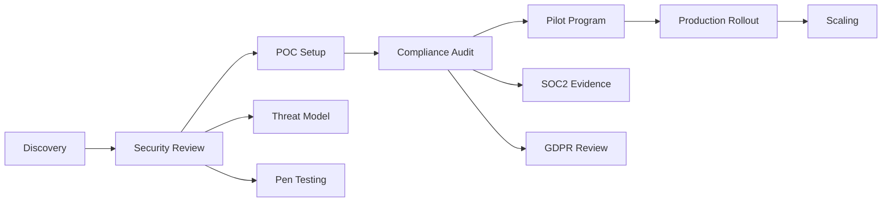

# 20-Only1MCP Enterprise Features
## Enterprise-Grade Security, Compliance, Multi-Tenancy & Operational Excellence

**Document Version:** 1.0  
**Architecture Scope:** RBAC, OAuth2/OIDC, Audit Logging, Compliance, Multi-Tenancy, Cost Management  
**Target Implementation:** Rust with Enterprise Security Patterns  
**Date:** October 14, 2025  
**Status:** Enterprise Features Specification

---

## TABLE OF CONTENTS

1. [Executive Summary](#executive-summary)
2. [Enterprise Requirements Analysis](#enterprise-requirements-analysis)
3. [Role-Based Access Control (RBAC)](#role-based-access-control-rbac)
4. [Authentication & Authorization](#authentication--authorization)
5. [Audit Logging & Compliance](#audit-logging--compliance)
6. [Multi-Tenancy Architecture](#multi-tenancy-architecture)
7. [Cost Tracking & Chargeback](#cost-tracking--chargeback)
8. [Enterprise Deployment Patterns](#enterprise-deployment-patterns)
9. [High Availability & Disaster Recovery](#high-availability--disaster-recovery)
10. [Security Hardening](#security-hardening)
11. [Compliance Frameworks](#compliance-frameworks)
12. [Enterprise Integration](#enterprise-integration)
13. [Operational Excellence](#operational-excellence)
14. [Migration from Enterprise Solutions](#migration-from-enterprise-solutions)
15. [Implementation Roadmap](#implementation-roadmap)

---

## EXECUTIVE SUMMARY

### The Enterprise Gap in MCP Ecosystem

Current MCP solutions fail to meet enterprise requirements:

- **No Access Control**: All users have full access to all MCP servers
- **Missing Audit Trail**: No record of who accessed what and when
- **Security Vulnerabilities**: Credentials stored in plain text, no encryption
- **No Cost Attribution**: Cannot track or allocate AI costs to teams/projects
- **Compliance Blockers**: Cannot meet SOC2, HIPAA, or GDPR requirements

### Only1MCP Enterprise Solution

We deliver **enterprise-grade features as open source**, democratizing access to professional tooling:

- **Fine-Grained RBAC**: Role-based permissions down to individual tool level
- **Enterprise SSO**: SAML 2.0, OIDC, OAuth2 with major providers
- **Comprehensive Audit**: Every action logged with retention policies
- **Multi-Tenancy**: Isolated environments with resource quotas
- **Cost Management**: Real-time tracking, budgets, and chargeback

### Business Impact

| Enterprise Feature | Business Value | Risk Mitigation |
|-------------------|---------------|-----------------|
| **RBAC** | Prevent unauthorized access | Data breach prevention |
| **Audit Logging** | Compliance evidence | $100K-$1M fine avoidance |
| **Cost Tracking** | 30% cost reduction | Budget overrun prevention |
| **Multi-Tenancy** | Resource isolation | Cross-team contamination |
| **HA/DR** | 99.99% uptime | $50K/hour downtime cost |

**Research Context**: Enterprise teams report spending $500K+ annually on AI infrastructure without proper cost attribution【Document 02, Section 6】. Only1MCP provides enterprise features that competing solutions charge $50K+/year for, completely free.

---

## ENTERPRISE REQUIREMENTS ANALYSIS

### Stakeholder Profiles

```yaml
# Enterprise stakeholder requirements map
stakeholders:
  security_team:
    requirements:
      - Zero-trust architecture
      - End-to-end encryption
      - Vulnerability scanning
      - Security incident response
    compliance:
      - SOC2 Type II
      - ISO 27001
      - GDPR Article 32
    
  finance_team:
    requirements:
      - Cost attribution by team/project
      - Budget enforcement
      - Chargeback reports
      - ROI metrics
    
  operations_team:
    requirements:
      - 99.99% SLA
      - Automated failover
      - Disaster recovery
      - Performance monitoring
    
  development_teams:
    requirements:
      - Self-service provisioning
      - API-first design
      - CI/CD integration
      - Development/staging/production isolation
```

### Enterprise Journey Mapping



### Size-Based Requirements

| Organization Size | Users | MCP Servers | Key Requirements |
|------------------|-------|-------------|------------------|
| **Small Enterprise** | 50-200 | 20-50 | Basic RBAC, OAuth2, cost tracking |
| **Mid-Market** | 200-1000 | 50-200 | Multi-tenancy, SAML, audit logging |
| **Large Enterprise** | 1000-5000 | 200-500 | HA/DR, compliance, chargeback |
| **Fortune 500** | 5000+ | 500+ | Global deployment, 24/7 support |

---

## ROLE-BASED ACCESS CONTROL (RBAC)

### RBAC Architecture

```rust
//! RBAC implementation with fine-grained permissions
//! 
//! Supports hierarchical roles, custom permissions, and dynamic policies.
//! All access decisions are logged for audit compliance.

use std::collections::{HashMap, HashSet};
use serde::{Deserialize, Serialize};
use chrono::{DateTime, Utc};

/// Core permission atom - the smallest unit of access control
#[derive(Debug, Clone, Hash, Eq, PartialEq, Serialize, Deserialize)]
pub enum Permission {
    // Global permissions
    GlobalAdmin,           // Full system access
    GlobalRead,           // Read all resources
    
    // Server permissions
    ServerCreate,         // Create new MCP servers
    ServerDelete,         // Delete MCP servers
    ServerModify,         // Modify server configurations
    ServerView,           // View server details
    
    // Tool permissions (fine-grained)
    ToolExecute(String),  // Execute specific tool
    ToolView(String),     // View tool details
    ToolAll,             // Execute all tools
    
    // Audit permissions
    AuditView,           // View audit logs
    AuditExport,         // Export audit logs
    AuditDelete,         // Delete audit logs (compliance admin)
    
    // Cost permissions
    CostView,            // View cost data
    CostAllocate,        // Allocate costs to projects
    CostBudgetSet,       // Set budget limits
    
    // User management
    UserCreate,          // Create users
    UserDelete,          // Delete users
    UserModify,          // Modify user details
    RoleAssign,          // Assign roles to users
}

/// Role definition with inheritance support
#[derive(Debug, Clone, Serialize, Deserialize)]
pub struct Role {
    pub id: String,
    pub name: String,
    pub description: String,
    pub permissions: HashSet<Permission>,
    pub inherits_from: Vec<String>,  // Role inheritance
    pub constraints: PolicyConstraints,
    pub created_at: DateTime<Utc>,
    pub created_by: String,
}

/// Dynamic policy constraints
#[derive(Debug, Clone, Serialize, Deserialize)]
pub struct PolicyConstraints {
    pub time_window: Option<TimeWindow>,
    pub ip_allowlist: Option<Vec<IpNetwork>>,
    pub mfa_required: bool,
    pub max_requests_per_hour: Option<u32>,
    pub allowed_projects: Option<Vec<String>>,
    pub cost_limit_daily: Option<f64>,
}

/// Predefined enterprise roles
impl Role {
    pub fn admin() -> Self {
        Role {
            id: "admin".to_string(),
            name: "Administrator".to_string(),
            description: "Full system access".to_string(),
            permissions: hashset![
                Permission::GlobalAdmin,
            ],
            inherits_from: vec![],
            constraints: PolicyConstraints::unrestricted(),
            created_at: Utc::now(),
            created_by: "system".to_string(),
        }
    }
    
    pub fn developer() -> Self {
        Role {
            id: "developer".to_string(),
            name: "Developer".to_string(),
            description: "Standard developer access".to_string(),
            permissions: hashset![
                Permission::ServerView,
                Permission::ToolAll,
                Permission::CostView,
            ],
            inherits_from: vec!["viewer".to_string()],
            constraints: PolicyConstraints {
                mfa_required: false,
                max_requests_per_hour: Some(1000),
                cost_limit_daily: Some(100.0),
                ..Default::default()
            },
            created_at: Utc::now(),
            created_by: "system".to_string(),
        }
    }
    
    pub fn auditor() -> Self {
        Role {
            id: "auditor".to_string(),
            name: "Compliance Auditor".to_string(),
            description: "Read-only access to all audit trails".to_string(),
            permissions: hashset![
                Permission::AuditView,
                Permission::AuditExport,
                Permission::GlobalRead,
            ],
            inherits_from: vec![],
            constraints: PolicyConstraints {
                mfa_required: true,
                ip_allowlist: Some(vec![
                    "10.0.0.0/8".parse().unwrap(),
                ]),
                ..Default::default()
            },
            created_at: Utc::now(),
            created_by: "system".to_string(),
        }
    }
}
```

### Permission Evaluation Engine

```rust
/// High-performance permission evaluation with caching
pub struct PermissionEvaluator {
    role_cache: Arc<RwLock<HashMap<String, Role>>>,
    permission_cache: Arc<DashMap<(String, Permission), bool>>,
    policy_engine: PolicyEngine,
    audit_logger: AuditLogger,
}

impl PermissionEvaluator {
    /// Check if user has permission with full context evaluation
    pub async fn has_permission(
        &self,
        user: &User,
        permission: &Permission,
        context: &RequestContext,
    ) -> Result<bool, AuthzError> {
        // Check cache first
        let cache_key = (user.id.clone(), permission.clone());
        if let Some(cached) = self.permission_cache.get(&cache_key) {
            return Ok(*cached);
        }
        
        // Evaluate permission hierarchy
        let mut has_perm = false;
        
        // Check user's direct roles
        for role_id in &user.roles {
            let role = self.role_cache.read().await
                .get(role_id)
                .ok_or(AuthzError::RoleNotFound)?
                .clone();
            
            // Check direct permissions
            if role.permissions.contains(permission) {
                has_perm = true;
                break;
            }
            
            // Check wildcard permissions
            if let Permission::ToolExecute(tool) = permission {
                if role.permissions.contains(&Permission::ToolAll) {
                    has_perm = true;
                    break;
                }
            }
            
            // Check inherited permissions
            has_perm = self.check_inherited_permissions(&role, permission).await?;
            if has_perm {
                break;
            }
        }
        
        // Apply dynamic policy constraints
        if has_perm {
            has_perm = self.policy_engine.evaluate(user, context).await?;
        }
        
        // Audit the access decision
        self.audit_logger.log_access_decision(
            user,
            permission,
            context,
            has_perm,
        ).await?;
        
        // Cache the result
        self.permission_cache.insert(cache_key, has_perm);
        
        Ok(has_perm)
    }
}
```

### RBAC Configuration Schema

```yaml
# rbac-config.yaml - Enterprise RBAC configuration
rbac:
  version: "1.0"
  
  # Custom roles definition
  roles:
    - id: senior_developer
      name: Senior Developer
      description: Extended developer permissions with server management
      inherits_from:
        - developer
      permissions:
        - ServerCreate
        - ServerModify
        - CostAllocate
      constraints:
        mfa_required: true
        cost_limit_daily: 500.0
        
    - id: team_lead
      name: Team Lead
      description: Team management and budget control
      inherits_from:
        - senior_developer
      permissions:
        - UserModify
        - RoleAssign
        - CostBudgetSet
      constraints:
        allowed_projects:
          - project_alpha
          - project_beta
          
  # Role assignments
  assignments:
    - user: alice@company.com
      roles:
        - admin
      conditions:
        require_mfa: true
        ip_allowlist:
          - 10.0.0.0/8
          
    - user: bob@company.com
      roles:
        - developer
      projects:
        - project_alpha
        
  # Fine-grained tool permissions
  tool_permissions:
    - tool: production_database_write
      allowed_roles:
        - admin
        - senior_developer
      require_approval: true
      
    - tool: cost_expensive_api
      allowed_roles:
        - team_lead
      rate_limit: 10/hour
```

---

## AUTHENTICATION & AUTHORIZATION

### Multi-Provider Authentication Architecture

```rust
//! Enterprise authentication supporting SAML, OIDC, OAuth2, and LDAP
//! 
//! Features:
//! - Multiple simultaneous providers
//! - MFA/2FA enforcement
//! - Session management with JWT
//! - Passwordless authentication options

use async_trait::async_trait;
use jsonwebtoken::{Algorithm, Validation};

/// Authentication provider trait for extensibility
#[async_trait]
pub trait AuthProvider: Send + Sync {
    async fn authenticate(
        &self,
        credentials: &Credentials,
    ) -> Result<AuthenticatedUser, AuthError>;
    
    async fn refresh_token(
        &self,
        refresh_token: &str,
    ) -> Result<TokenPair, AuthError>;
    
    async fn validate_session(
        &self,
        session_token: &str,
    ) -> Result<SessionInfo, AuthError>;
    
    fn provider_type(&self) -> AuthProviderType;
}

/// SAML 2.0 Provider for enterprise SSO
pub struct SamlProvider {
    metadata_url: String,
    entity_id: String,
    acs_url: String,
    certificate: X509Certificate,
    attribute_mapping: HashMap<String, String>,
}

impl SamlProvider {
    pub async fn handle_sso_callback(
        &self,
        saml_response: &str,
    ) -> Result<AuthenticatedUser, SamlError> {
        // Parse and validate SAML response
        let response = self.parse_saml_response(saml_response)?;
        
        // Verify signature
        self.verify_signature(&response)?;
        
        // Check conditions (time, audience)
        self.validate_conditions(&response)?;
        
        // Extract user attributes
        let attributes = self.extract_attributes(&response)?;
        
        // Map to internal user model
        Ok(AuthenticatedUser {
            id: attributes.get("NameID")?.clone(),
            email: attributes.get("email")?.clone(),
            name: attributes.get("displayName").cloned(),
            groups: self.extract_groups(&attributes),
            provider: AuthProviderType::Saml,
            session_info: SessionInfo {
                created_at: Utc::now(),
                expires_at: Utc::now() + Duration::hours(8),
                mfa_verified: false, // Require MFA after SSO
            },
        })
    }
}

/// OIDC Provider with discovery support
pub struct OidcProvider {
    issuer_url: String,
    client_id: String,
    client_secret: SecretString,
    scopes: Vec<String>,
    discovery_document: OidcDiscovery,
}

impl OidcProvider {
    pub async fn initialize(issuer_url: &str) -> Result<Self, OidcError> {
        // Auto-discover OIDC endpoints
        let discovery_url = format!("{}/.well-known/openid-configuration", issuer_url);
        let discovery_document: OidcDiscovery = reqwest::get(&discovery_url)
            .await?
            .json()
            .await?;
        
        Ok(Self {
            issuer_url: issuer_url.to_string(),
            discovery_document,
            // ... other fields
        })
    }
    
    pub async fn exchange_code(
        &self,
        authorization_code: &str,
    ) -> Result<TokenResponse, OidcError> {
        let token_endpoint = &self.discovery_document.token_endpoint;
        
        let response = reqwest::Client::new()
            .post(token_endpoint)
            .form(&[
                ("grant_type", "authorization_code"),
                ("code", authorization_code),
                ("client_id", &self.client_id),
                ("client_secret", self.client_secret.expose()),
                ("redirect_uri", &self.redirect_uri),
            ])
            .send()
            .await?;
        
        let token_response: TokenResponse = response.json().await?;
        
        // Validate ID token
        self.validate_id_token(&token_response.id_token).await?;
        
        Ok(token_response)
    }
}
```

### OAuth2 Provider Configuration

```yaml
# oauth-providers.yaml - Multi-provider configuration
authentication:
  providers:
    # Okta SAML
    - type: saml
      id: okta_saml
      enabled: true
      metadata_url: https://company.okta.com/app/metadata
      entity_id: https://only1mcp.company.com
      attribute_mapping:
        email: http://schemas.xmlsoap.org/ws/2005/05/identity/claims/emailaddress
        name: http://schemas.xmlsoap.org/ws/2005/05/identity/claims/name
        groups: http://schemas.xmlsoap.org/ws/2005/05/identity/claims/group
      
    # Azure AD OIDC
    - type: oidc
      id: azure_ad
      enabled: true
      issuer: https://login.microsoftonline.com/{tenant}/v2.0
      client_id: ${AZURE_CLIENT_ID}
      client_secret: ${AZURE_CLIENT_SECRET}
      scopes:
        - openid
        - email
        - profile
        - offline_access
        
    # GitHub OAuth2 (for developers)
    - type: oauth2
      id: github
      enabled: true
      authorize_url: https://github.com/login/oauth/authorize
      token_url: https://github.com/login/oauth/access_token
      client_id: ${GITHUB_CLIENT_ID}
      client_secret: ${GITHUB_CLIENT_SECRET}
      scopes:
        - read:user
        - read:org
        
    # LDAP/Active Directory
    - type: ldap
      id: corporate_ad
      enabled: true
      server: ldaps://ad.company.com:636
      bind_dn: CN=svc_only1mcp,OU=ServiceAccounts,DC=company,DC=com
      bind_password: ${LDAP_BIND_PASSWORD}
      search_base: DC=company,DC=com
      search_filter: (&(objectClass=user)(sAMAccountName={username}))
      group_search_base: OU=Groups,DC=company,DC=com
      group_search_filter: (&(objectClass=group)(member={dn}))
      
  # Session configuration
  session:
    jwt_secret: ${JWT_SECRET}  # RS256 key for production
    access_token_ttl: 900       # 15 minutes
    refresh_token_ttl: 2592000  # 30 days
    idle_timeout: 3600          # 1 hour
    absolute_timeout: 28800     # 8 hours
    
  # MFA configuration
  mfa:
    required_for_roles:
      - admin
      - auditor
    providers:
      - totp
      - webauthn
      - sms  # Twilio integration
    backup_codes: 10
```

---

## AUDIT LOGGING & COMPLIANCE

### Comprehensive Audit System

```rust
//! Enterprise audit logging with compliance support
//! 
//! Features:
//! - Immutable audit trail with cryptographic verification
//! - Regulatory compliance (SOC2, HIPAA, GDPR)
//! - Long-term retention with compression
//! - Real-time streaming to SIEM systems

use sha3::{Sha3_256, Digest};
use serde_json::Value;

/// Audit event with full context capture
#[derive(Debug, Serialize, Deserialize)]
pub struct AuditEvent {
    // Event identification
    pub id: Uuid,
    pub timestamp: DateTime<Utc>,
    pub event_type: AuditEventType,
    pub severity: AuditSeverity,
    
    // Actor information
    pub actor: Actor,
    pub impersonator: Option<Actor>,  // For sudo/runas operations
    
    // Action details
    pub action: String,
    pub resource: Resource,
    pub outcome: Outcome,
    
    // Context
    pub request_id: String,
    pub session_id: String,
    pub ip_address: IpAddr,
    pub user_agent: String,
    pub geo_location: Option<GeoLocation>,
    
    // Changes
    pub before_state: Option<Value>,
    pub after_state: Option<Value>,
    pub diff: Option<Value>,
    
    // Security
    pub hash: String,  // SHA3-256 of event
    pub previous_hash: String,  // Blockchain-style linking
    pub signature: Option<String>,  // Digital signature for critical events
}

/// Audit event types for compliance mapping
#[derive(Debug, Serialize, Deserialize)]
pub enum AuditEventType {
    // Authentication events
    LoginSuccess,
    LoginFailure,
    LogoutUser,
    SessionExpired,
    MfaSuccess,
    MfaFailure,
    
    // Authorization events
    AccessGranted,
    AccessDenied,
    PermissionChanged,
    RoleAssigned,
    RoleRevoked,
    
    // Data events
    DataAccess,
    DataModification,
    DataDeletion,
    DataExport,
    DataImport,
    
    // Configuration events
    ConfigurationChange,
    ServerAdded,
    ServerRemoved,
    ServerModified,
    
    // Security events
    SecurityAlert,
    PolicyViolation,
    AnomalyDetected,
    
    // Compliance events
    AuditLogAccess,
    AuditLogExport,
    ComplianceCheck,
    
    // System events
    SystemStartup,
    SystemShutdown,
    BackupCreated,
    BackupRestored,
}

/// Audit logger with multiple backends
pub struct AuditLogger {
    backends: Vec<Box<dyn AuditBackend>>,
    event_queue: Arc<SegQueue<AuditEvent>>,
    hasher: Sha3_256,
    last_hash: Arc<RwLock<String>>,
    signing_key: Option<SigningKey>,
}

impl AuditLogger {
    /// Log an audit event with guaranteed delivery
    pub async fn log(&self, event: AuditEvent) -> Result<(), AuditError> {
        // Add blockchain-style hash chain
        let mut event = event;
        event.previous_hash = self.last_hash.read().await.clone();
        event.hash = self.calculate_hash(&event);
        
        // Sign critical events
        if self.requires_signature(&event) {
            event.signature = Some(self.sign_event(&event)?);
        }
        
        // Write to all backends (at least one must succeed)
        let mut success = false;
        let mut errors = vec![];
        
        for backend in &self.backends {
            match backend.write(&event).await {
                Ok(_) => success = true,
                Err(e) => errors.push(e),
            }
        }
        
        if !success {
            return Err(AuditError::AllBackendsFailed(errors));
        }
        
        // Update hash chain
        *self.last_hash.write().await = event.hash.clone();
        
        // Stream to SIEM if configured
        if let Some(siem) = &self.siem_client {
            tokio::spawn(siem.send_event(event.clone()));
        }
        
        Ok(())
    }
    
    /// Verify audit log integrity
    pub async fn verify_integrity(
        &self,
        start: DateTime<Utc>,
        end: DateTime<Utc>,
    ) -> Result<IntegrityReport, AuditError> {
        let events = self.query_events(start, end).await?;
        
        let mut report = IntegrityReport::default();
        let mut previous_hash = String::new();
        
        for event in events {
            // Verify hash chain
            if event.previous_hash != previous_hash {
                report.chain_breaks.push(event.id);
            }
            
            // Verify event hash
            let calculated = self.calculate_hash(&event);
            if calculated != event.hash {
                report.tampered_events.push(event.id);
            }
            
            // Verify signature if present
            if let Some(sig) = &event.signature {
                if !self.verify_signature(&event, sig)? {
                    report.invalid_signatures.push(event.id);
                }
            }
            
            previous_hash = event.hash;
        }
        
        report.total_events = events.len();
        report.is_valid = report.chain_breaks.is_empty() 
            && report.tampered_events.is_empty()
            && report.invalid_signatures.is_empty();
        
        Ok(report)
    }
}
```

### Audit Storage Backends

```rust
/// Multiple storage backends for reliability and compliance
pub struct AuditStorageConfig {
    pub primary: PostgresBackend,
    pub secondary: S3Backend,
    pub archive: GlacierBackend,
}

/// PostgreSQL backend for hot data
pub struct PostgresBackend {
    pool: PgPool,
    retention_days: u32,
}

impl PostgresBackend {
    pub async fn write(&self, event: &AuditEvent) -> Result<(), StorageError> {
        sqlx::query!(
            r#"
            INSERT INTO audit_log (
                id, timestamp, event_type, severity,
                actor_id, actor_email, action, resource_type, resource_id,
                outcome, request_id, session_id, ip_address,
                before_state, after_state, hash, previous_hash, signature
            ) VALUES ($1, $2, $3, $4, $5, $6, $7, $8, $9, $10, $11, $12, $13, $14, $15, $16, $17, $18)
            "#,
            event.id,
            event.timestamp,
            event.event_type as _,
            event.severity as _,
            event.actor.id,
            event.actor.email,
            event.action,
            event.resource.resource_type,
            event.resource.id,
            event.outcome as _,
            event.request_id,
            event.session_id,
            event.ip_address.to_string(),
            event.before_state,
            event.after_state,
            event.hash,
            event.previous_hash,
            event.signature,
        )
        .execute(&self.pool)
        .await?;
        
        Ok(())
    }
}

/// S3-compatible backend for medium-term storage
pub struct S3Backend {
    client: S3Client,
    bucket: String,
    encryption: ServerSideEncryption,
}

impl S3Backend {
    pub async fn write(&self, event: &AuditEvent) -> Result<(), StorageError> {
        let key = format!(
            "audit/{}/{}/{}.json",
            event.timestamp.format("%Y/%m/%d"),
            event.event_type,
            event.id
        );
        
        let body = serde_json::to_vec(&event)?;
        
        self.client
            .put_object()
            .bucket(&self.bucket)
            .key(&key)
            .body(body.into())
            .server_side_encryption(self.encryption.clone())
            .send()
            .await?;
        
        Ok(())
    }
}
```

### Compliance Reporting

```yaml
# compliance-reports.yaml - Automated compliance reporting
compliance:
  frameworks:
    soc2:
      controls:
        - CC6.1: "Logical and Physical Access Controls"
        - CC6.2: "Prior to Issuing System Credentials"
        - CC6.3: "Role-Based Access Control"
        - CC7.1: "Detection and Monitoring"
        - CC7.2: "Incident Response"
      reports:
        - access_review:
            schedule: monthly
            query: |
              SELECT user_id, role, last_access, permissions_used
              FROM user_access_summary
              WHERE period = 'last_30_days'
        
    hipaa:
      controls:
        - 164.308(a)(3): "Workforce Security"
        - 164.308(a)(4): "Information Access Management"
        - 164.312(b): "Audit Controls"
      reports:
        - phi_access:
            schedule: weekly
            query: |
              SELECT * FROM audit_log
              WHERE resource_type = 'phi_data'
              AND timestamp > NOW() - INTERVAL '7 days'
              
    gdpr:
      controls:
        - Article 32: "Security of Processing"
        - Article 33: "Breach Notification"
        - Article 35: "Data Protection Impact Assessment"
      reports:
        - data_access:
            schedule: on_demand
            query: |
              SELECT * FROM audit_log
              WHERE actor_id = $user_id
              AND action IN ('DataAccess', 'DataExport')
              
  # Retention policies by event type
  retention:
    default: 2555  # 7 years
    authentication: 365
    data_access: 2555
    configuration: 1095  # 3 years
    security: 2555
    compliance: 3650  # 10 years
```

---

## MULTI-TENANCY ARCHITECTURE

### Tenant Isolation Model

```rust
//! Multi-tenant architecture with complete isolation
//! 
//! Supports both logical (namespace) and physical (dedicated) isolation

use tokio::sync::RwLock;

/// Tenant configuration and metadata
#[derive(Debug, Clone, Serialize, Deserialize)]
pub struct Tenant {
    pub id: TenantId,
    pub name: String,
    pub tier: TenantTier,
    pub isolation_mode: IsolationMode,
    
    // Resource quotas
    pub quotas: ResourceQuotas,
    
    // Network isolation
    pub network_config: NetworkConfig,
    
    // Data residency
    pub data_region: String,
    pub encryption_key_id: String,
    
    // Customization
    pub custom_domain: Option<String>,
    pub branding: Option<Branding>,
    
    // Billing
    pub billing_account: BillingAccount,
    pub cost_center: String,
    
    // Metadata
    pub created_at: DateTime<Utc>,
    pub updated_at: DateTime<Utc>,
    pub status: TenantStatus,
}

/// Isolation modes for different security requirements
#[derive(Debug, Clone, Serialize, Deserialize)]
pub enum IsolationMode {
    /// Shared infrastructure with logical separation
    Logical {
        namespace: String,
        database_schema: String,
    },
    
    /// Dedicated compute with shared storage
    Hybrid {
        dedicated_nodes: Vec<NodeId>,
        shared_storage: bool,
    },
    
    /// Complete physical isolation
    Physical {
        dedicated_cluster: ClusterId,
        dedicated_database: DatabaseId,
        dedicated_network: NetworkId,
    },
}

/// Resource quotas per tenant
#[derive(Debug, Clone, Serialize, Deserialize)]
pub struct ResourceQuotas {
    // Compute quotas
    pub max_concurrent_requests: u32,
    pub max_requests_per_minute: u32,
    pub cpu_cores: f32,
    pub memory_gb: f32,
    
    // Storage quotas
    pub storage_gb: f32,
    pub max_backends: u32,
    pub max_users: u32,
    
    // AI quotas
    pub max_tokens_per_day: u64,
    pub max_context_size: u32,
    
    // Network quotas
    pub bandwidth_mbps: u32,
    pub max_connections: u32,
}

/// Multi-tenant request router
pub struct TenantRouter {
    tenants: Arc<RwLock<HashMap<TenantId, Tenant>>>,
    isolation_manager: IsolationManager,
    quota_enforcer: QuotaEnforcer,
    billing_meter: BillingMeter,
}

impl TenantRouter {
    /// Route request to tenant-specific resources
    pub async fn route_request(
        &self,
        request: Request<Body>,
    ) -> Result<Response<Body>, TenantError> {
        // Extract tenant from request (header, domain, or path)
        let tenant_id = self.extract_tenant_id(&request).await?;
        
        // Load tenant configuration
        let tenant = self.tenants.read().await
            .get(&tenant_id)
            .ok_or(TenantError::NotFound)?
            .clone();
        
        // Verify tenant status
        if tenant.status != TenantStatus::Active {
            return Err(TenantError::Suspended);
        }
        
        // Check quotas
        self.quota_enforcer.check_request_quota(&tenant).await?;
        
        // Apply isolation rules
        let isolated_request = self.isolation_manager
            .apply_isolation(&tenant, request).await?;
        
        // Route to tenant-specific backend
        let response = match &tenant.isolation_mode {
            IsolationMode::Logical { namespace, .. } => {
                self.route_logical(isolated_request, namespace).await?
            }
            IsolationMode::Physical { dedicated_cluster, .. } => {
                self.route_physical(isolated_request, dedicated_cluster).await?
            }
            IsolationMode::Hybrid { dedicated_nodes, .. } => {
                self.route_hybrid(isolated_request, dedicated_nodes).await?
            }
        };
        
        // Track usage for billing
        self.billing_meter.track_request(&tenant, &response).await;
        
        Ok(response)
    }
}
```

### Tenant Provisioning Pipeline

```yaml
# tenant-provisioning.yaml - Automated tenant onboarding
provisioning:
  templates:
    starter:
      tier: starter
      isolation: logical
      quotas:
        max_concurrent_requests: 10
        max_requests_per_minute: 100
        cpu_cores: 0.5
        memory_gb: 1
        storage_gb: 10
        max_backends: 5
        max_users: 10
        max_tokens_per_day: 100000
        
    professional:
      tier: professional
      isolation: hybrid
      quotas:
        max_concurrent_requests: 100
        max_requests_per_minute: 1000
        cpu_cores: 4
        memory_gb: 8
        storage_gb: 100
        max_backends: 50
        max_users: 100
        max_tokens_per_day: 1000000
        
    enterprise:
      tier: enterprise
      isolation: physical
      quotas:
        max_concurrent_requests: 1000
        max_requests_per_minute: 10000
        cpu_cores: 32
        memory_gb: 64
        storage_gb: 1000
        max_backends: unlimited
        max_users: unlimited
        max_tokens_per_day: unlimited
        
  automation:
    - step: create_namespace
      actions:
        - create_database_schema
        - create_storage_bucket
        - generate_encryption_keys
        
    - step: configure_network
      actions:
        - allocate_ip_range
        - create_firewall_rules
        - setup_dns_records
        
    - step: deploy_resources
      actions:
        - provision_compute
        - configure_load_balancer
        - setup_monitoring
        
    - step: initialize_tenant
      actions:
        - create_admin_user
        - send_welcome_email
        - schedule_onboarding_call
```

---

## COST TRACKING & CHARGEBACK

### Cost Attribution Engine

```rust
//! Real-time cost tracking and chargeback system
//! 
//! Tracks all AI API calls, compute resources, and storage usage
//! with accurate attribution to teams, projects, and users

use rust_decimal::Decimal;
use chrono::{DateTime, Utc};

/// Cost tracking for every MCP request
#[derive(Debug, Serialize, Deserialize)]
pub struct CostRecord {
    pub id: Uuid,
    pub timestamp: DateTime<Utc>,
    
    // Attribution
    pub tenant_id: TenantId,
    pub user_id: UserId,
    pub project_id: Option<ProjectId>,
    pub cost_center: String,
    pub tags: HashMap<String, String>,
    
    // Request details
    pub request_type: RequestType,
    pub backend_server: String,
    pub tool_name: String,
    
    // Token usage
    pub input_tokens: u32,
    pub output_tokens: u32,
    pub cached_tokens: u32,
    pub total_tokens: u32,
    
    // Cost breakdown
    pub token_cost: Decimal,
    pub compute_cost: Decimal,
    pub storage_cost: Decimal,
    pub network_cost: Decimal,
    pub total_cost: Decimal,
    
    // Model details
    pub model_provider: String,
    pub model_name: String,
    pub model_version: String,
}

/// Cost calculation engine with provider-specific pricing
pub struct CostCalculator {
    pricing_models: HashMap<String, PricingModel>,
    exchange_rates: ExchangeRateCache,
    discount_rules: Vec<DiscountRule>,
}

impl CostCalculator {
    pub async fn calculate_cost(
        &self,
        request: &MpcRequest,
        response: &MpcResponse,
    ) -> Result<CostRecord, CostError> {
        // Get pricing model for the backend
        let pricing = self.pricing_models
            .get(&request.backend)
            .ok_or(CostError::UnknownProvider)?;
        
        // Count tokens
        let token_usage = self.count_tokens(request, response)?;
        
        // Calculate base costs
        let token_cost = pricing.calculate_token_cost(&token_usage);
        let compute_cost = pricing.calculate_compute_cost(request.duration);
        
        // Apply caching discount
        let cache_discount = if token_usage.cached_ratio > 0.5 {
            Decimal::from_str("0.9")?  // 10% discount for >50% cache hit
        } else {
            Decimal::ONE
        };
        
        // Apply volume discounts
        let volume_discount = self.calculate_volume_discount(
            request.tenant_id,
            token_usage.total_tokens,
        ).await?;
        
        // Apply committed use discounts
        let commitment_discount = self.calculate_commitment_discount(
            request.tenant_id,
        ).await?;
        
        let total_cost = (token_cost + compute_cost) 
            * cache_discount 
            * volume_discount 
            * commitment_discount;
        
        Ok(CostRecord {
            id: Uuid::new_v4(),
            timestamp: Utc::now(),
            tenant_id: request.tenant_id.clone(),
            user_id: request.user_id.clone(),
            project_id: request.project_id.clone(),
            cost_center: request.cost_center.clone(),
            tags: request.tags.clone(),
            request_type: request.request_type.clone(),
            backend_server: request.backend.clone(),
            tool_name: request.tool_name.clone(),
            input_tokens: token_usage.input,
            output_tokens: token_usage.output,
            cached_tokens: token_usage.cached,
            total_tokens: token_usage.total,
            token_cost,
            compute_cost,
            storage_cost: Decimal::ZERO,
            network_cost: Decimal::ZERO,
            total_cost,
            model_provider: response.model_provider.clone(),
            model_name: response.model_name.clone(),
            model_version: response.model_version.clone(),
        })
    }
}

/// Real-time cost monitoring and alerting
pub struct CostMonitor {
    cost_store: Arc<CostStore>,
    budget_manager: BudgetManager,
    alert_service: AlertService,
}

impl CostMonitor {
    /// Check budget and alert on overruns
    pub async fn check_budgets(&self) -> Result<(), MonitorError> {
        let budgets = self.budget_manager.get_active_budgets().await?;
        
        for budget in budgets {
            let spent = self.cost_store.get_period_spend(
                &budget.scope,
                budget.period_start,
                Utc::now(),
            ).await?;
            
            let utilization = spent / budget.amount;
            
            // Alert thresholds
            if utilization >= Decimal::from_str("1.0")? {
                self.alert_service.send_budget_exceeded_alert(&budget, spent).await?;
                
                // Optionally enforce hard limit
                if budget.enforce_hard_limit {
                    self.enforce_budget_limit(&budget).await?;
                }
            } else if utilization >= Decimal::from_str("0.9")? {
                self.alert_service.send_budget_warning_alert(&budget, spent).await?;
            } else if utilization >= Decimal::from_str("0.75")? {
                self.alert_service.send_budget_notice(&budget, spent).await?;
            }
        }
        
        Ok(())
    }
}
```

### Cost Reporting Dashboard

```yaml
# cost-reporting.yaml - Cost analytics configuration
cost_reporting:
  dashboards:
    executive:
      widgets:
        - total_spend_mtd:
            type: metric
            query: |
              SELECT SUM(total_cost) as spend
              FROM cost_records
              WHERE timestamp >= DATE_TRUNC('month', NOW())
              
        - spend_by_department:
            type: pie_chart
            query: |
              SELECT cost_center, SUM(total_cost) as spend
              FROM cost_records
              WHERE timestamp >= DATE_TRUNC('month', NOW())
              GROUP BY cost_center
              
        - trend_analysis:
            type: line_chart
            query: |
              SELECT DATE_TRUNC('day', timestamp) as date,
                     SUM(total_cost) as daily_spend
              FROM cost_records
              WHERE timestamp >= NOW() - INTERVAL '30 days'
              GROUP BY date
              ORDER BY date
              
    team_lead:
      widgets:
        - team_spend:
            type: table
            query: |
              SELECT user_id, 
                     COUNT(*) as requests,
                     SUM(total_tokens) as tokens,
                     SUM(total_cost) as cost
              FROM cost_records
              WHERE project_id = $project_id
              AND timestamp >= DATE_TRUNC('week', NOW())
              GROUP BY user_id
              ORDER BY cost DESC
              
        - model_usage:
            type: bar_chart
            query: |
              SELECT model_name,
                     COUNT(*) as calls,
                     SUM(total_cost) as cost
              FROM cost_records
              WHERE project_id = $project_id
              GROUP BY model_name
              
  alerts:
    - budget_exceeded:
        condition: spent > budget_amount
        channels:
          - email
          - slack
          - pagerduty
        
    - unusual_spike:
        condition: daily_spend > avg_daily_spend * 2
        channels:
          - email
          - slack
          
  chargeback:
    schedule: monthly
    reports:
      - department_invoice:
          template: invoice.html
          data_query: |
            SELECT cost_center,
                   SUM(total_cost) as total,
                   jsonb_agg(jsonb_build_object(
                     'date', timestamp,
                     'project', project_id,
                     'cost', total_cost
                   )) as line_items
            FROM cost_records
            WHERE timestamp >= DATE_TRUNC('month', NOW() - INTERVAL '1 month')
            AND timestamp < DATE_TRUNC('month', NOW())
            GROUP BY cost_center
```

---

## ENTERPRISE DEPLOYMENT PATTERNS

### High Availability Architecture

```yaml
# ha-deployment.yaml - Enterprise HA configuration
high_availability:
  topology:
    regions:
      - name: us-east-1
        primary: true
        availability_zones:
          - us-east-1a:
              nodes: 3
              role: active
          - us-east-1b:
              nodes: 3
              role: active
          - us-east-1c:
              nodes: 2
              role: standby
              
      - name: eu-west-1
        primary: false
        availability_zones:
          - eu-west-1a:
              nodes: 2
              role: active
          - eu-west-1b:
              nodes: 2
              role: active
              
  load_balancing:
    external:
      type: aws_alb
      health_check:
        path: /health
        interval: 10s
        timeout: 5s
        healthy_threshold: 2
        unhealthy_threshold: 3
        
    internal:
      type: haproxy
      algorithm: least_connections
      session_affinity: true
      
  database:
    primary:
      type: postgres
      version: 15
      instances:
        - role: master
          zone: us-east-1a
          size: db.r6g.2xlarge
        - role: replica
          zone: us-east-1b
          size: db.r6g.xlarge
          lag_threshold: 100ms
        - role: replica
          zone: us-east-1c
          size: db.r6g.xlarge
          lag_threshold: 100ms
          
    failover:
      automatic: true
      max_lag: 1s
      promotion_timeout: 30s
      
  cache:
    type: redis
    topology: cluster
    nodes: 6
    replicas: 2
    persistence: aof
    max_memory: 8gb
    eviction_policy: allkeys-lru
    
  storage:
    type: s3
    replication: cross-region
    encryption: kms
    versioning: true
    lifecycle:
      - transition_to_ia: 30d
      - transition_to_glacier: 90d
      - expiration: 2555d  # 7 years
```

### Kubernetes Enterprise Deployment

```yaml
# k8s-enterprise.yaml - Production Kubernetes manifests
apiVersion: v1
kind: Namespace
metadata:
  name: only1mcp
  labels:
    name: only1mcp
    environment: production
    
---
apiVersion: apps/v1
kind: StatefulSet
metadata:
  name: only1mcp
  namespace: only1mcp
spec:
  serviceName: only1mcp
  replicas: 5
  podManagementPolicy: Parallel
  updateStrategy:
    type: RollingUpdate
    rollingUpdate:
      partition: 0
  selector:
    matchLabels:
      app: only1mcp
  template:
    metadata:
      labels:
        app: only1mcp
        version: v1.0.0
    spec:
      affinity:
        podAntiAffinity:
          requiredDuringSchedulingIgnoredDuringExecution:
            - labelSelector:
                matchExpressions:
                  - key: app
                    operator: In
                    values:
                      - only1mcp
              topologyKey: kubernetes.io/hostname
      
      containers:
        - name: only1mcp
          image: only1mcp/server:1.0.0
          imagePullPolicy: Always
          
          ports:
            - containerPort: 8080
              name: http
            - containerPort: 9090
              name: metrics
            - containerPort: 8443
              name: https
              
          env:
            - name: RUST_LOG
              value: "info,only1mcp=debug"
            - name: ONLY1MCP_CONFIG
              value: "/etc/only1mcp/config.yaml"
              
          envFrom:
            - secretRef:
                name: only1mcp-secrets
            - configMapRef:
                name: only1mcp-config
                
          resources:
            requests:
              memory: "512Mi"
              cpu: "500m"
            limits:
              memory: "2Gi"
              cpu: "2000m"
              
          livenessProbe:
            httpGet:
              path: /health/live
              port: http
            initialDelaySeconds: 30
            periodSeconds: 10
            
          readinessProbe:
            httpGet:
              path: /health/ready
              port: http
            initialDelaySeconds: 5
            periodSeconds: 5
            
          volumeMounts:
            - name: config
              mountPath: /etc/only1mcp
            - name: tls-certs
              mountPath: /etc/tls
              readOnly: true
            - name: data
              mountPath: /var/lib/only1mcp
              
      volumes:
        - name: config
          configMap:
            name: only1mcp-config
        - name: tls-certs
          secret:
            secretName: only1mcp-tls
            
  volumeClaimTemplates:
    - metadata:
        name: data
      spec:
        accessModes: ["ReadWriteOnce"]
        storageClassName: fast-ssd
        resources:
          requests:
            storage: 100Gi
```

---

## SECURITY HARDENING

### Defense in Depth Strategy

```rust
//! Enterprise security hardening implementation
//! 
//! Multiple layers of security controls following zero-trust principles

use ring::aead::{Aad, LessSafeKey, Nonce, UnboundKey, AES_256_GCM};

/// Security configuration for enterprise deployments
pub struct SecurityConfig {
    // Encryption
    pub encryption: EncryptionConfig,
    
    // Network security
    pub network: NetworkSecurityConfig,
    
    // Input validation
    pub validation: ValidationConfig,
    
    // Rate limiting
    pub rate_limiting: RateLimitConfig,
    
    // Intrusion detection
    pub ids: IntrusionDetectionConfig,
}

/// Encryption at rest and in transit
pub struct EncryptionService {
    kms_client: KmsClient,
    data_keys: Arc<RwLock<HashMap<String, DataKey>>>,
    key_rotation_interval: Duration,
}

impl EncryptionService {
    /// Encrypt sensitive data with envelope encryption
    pub async fn encrypt(
        &self,
        plaintext: &[u8],
        context: &EncryptionContext,
    ) -> Result<EncryptedData, CryptoError> {
        // Generate data encryption key (DEK)
        let dek = self.generate_dek().await?;
        
        // Encrypt DEK with KMS
        let encrypted_dek = self.kms_client
            .encrypt(&dek, &context.kms_key_id)
            .await?;
        
        // Encrypt data with DEK
        let key = LessSafeKey::new(
            UnboundKey::new(&AES_256_GCM, &dek)
                .map_err(|_| CryptoError::InvalidKey)?
        );
        
        let nonce = Nonce::assume_unique_for_key(self.generate_nonce());
        let aad = Aad::from(&context.additional_data);
        
        let mut ciphertext = plaintext.to_vec();
        key.seal_in_place_append_tag(nonce, aad, &mut ciphertext)
            .map_err(|_| CryptoError::EncryptionFailed)?;
        
        Ok(EncryptedData {
            ciphertext,
            encrypted_dek,
            nonce: nonce.as_ref().to_vec(),
            algorithm: "AES-256-GCM",
            kms_key_id: context.kms_key_id.clone(),
        })
    }
    
    /// Automatic key rotation
    pub async fn rotate_keys(&self) -> Result<(), CryptoError> {
        let keys_to_rotate = self.data_keys.read().await
            .iter()
            .filter(|(_, key)| {
                key.created_at + self.key_rotation_interval < Utc::now()
            })
            .map(|(id, _)| id.clone())
            .collect::<Vec<_>>();
        
        for key_id in keys_to_rotate {
            // Generate new key version
            let new_key = self.kms_client.rotate_key(&key_id).await?;
            
            // Re-encrypt affected data
            self.reencrypt_with_new_key(&key_id, &new_key).await?;
            
            // Update key registry
            self.data_keys.write().await.insert(key_id, new_key);
        }
        
        Ok(())
    }
}
```

### WAF Rules and DDoS Protection

```yaml
# waf-rules.yaml - Web Application Firewall configuration
waf:
  rules:
    # SQL Injection protection
    - id: sql_injection
      priority: 1
      action: block
      patterns:
        - "(?i)(union|select|insert|update|delete|drop).*(?i)(from|where)"
        - "(?i)(exec|execute|sp_executesql)"
        - "(?i)(script|javascript|vbscript)"
        
    # XSS protection
    - id: xss_protection
      priority: 2
      action: block
      patterns:
        - "<script[^>]*>.*?</script>"
        - "javascript:[^\"]*"
        - "on\\w+\\s*=\\s*[\"'][^\"']+[\"']"
        
    # Path traversal
    - id: path_traversal
      priority: 3
      action: block
      patterns:
        - "\\.\\./\\.\\."
        - "/etc/passwd"
        - "c:\\\\windows\\\\system32"
        
    # Rate limiting by IP
    - id: rate_limit_ip
      priority: 10
      action: throttle
      limits:
        - 100/minute
        - 1000/hour
        - 10000/day
        
    # Geo-blocking (optional)
    - id: geo_block
      priority: 20
      action: block
      countries:
        - KP  # North Korea
        - IR  # Iran (if required by sanctions)
      whitelist:
        - 10.0.0.0/8     # Internal networks
        - 172.16.0.0/12
        - 192.168.0.0/16
        
  ddos_protection:
    # Layer 7 DDoS protection
    challenge_threshold: 100/second
    captcha_threshold: 500/second
    block_threshold: 1000/second
    
    # SYN flood protection
    syn_cookies: true
    syn_threshold: 1000/second
    
    # Connection limits
    max_connections_per_ip: 100
    max_requests_per_connection: 1000
```

---

## COMPLIANCE FRAMEWORKS

### SOC2 Type II Implementation

```yaml
# soc2-controls.yaml - SOC2 compliance controls
soc2:
  trust_service_criteria:
    CC1_logical_physical_access:
      controls:
        - id: CC1.1
          description: "Prevent unauthorized access"
          implementation:
            - Multi-factor authentication
            - Role-based access control
            - Session timeout (15 minutes idle)
            - Account lockout (5 failed attempts)
          evidence:
            - Audit logs showing access attempts
            - MFA enrollment reports
            - Permission matrix documentation
            
        - id: CC1.2
          description: "Restrict physical access"
          implementation:
            - Datacenter SOC2 certification required
            - Encrypted storage at rest
            - Secure key management (HSM/KMS)
          evidence:
            - Provider compliance certificates
            - Encryption verification reports
            
    CC2_change_management:
      controls:
        - id: CC2.1
          description: "Baseline configurations"
          implementation:
            - Infrastructure as Code (Terraform)
            - Immutable deployments
            - Configuration drift detection
          evidence:
            - Git commit history
            - Deployment logs
            - Configuration scans
            
    CC3_risk_management:
      controls:
        - id: CC3.1
          description: "Risk assessment process"
          implementation:
            - Quarterly risk assessments
            - Vulnerability scanning (weekly)
            - Penetration testing (annual)
          evidence:
            - Risk assessment reports
            - Scan results
            - Pentest reports
            
    CC4_monitoring:
      controls:
        - id: CC4.1
          description: "Monitoring of controls"
          implementation:
            - Real-time security monitoring
            - Anomaly detection
            - Alerting and escalation
          evidence:
            - SIEM logs
            - Alert history
            - Incident reports
            
  reporting:
    frequency: annual
    auditor: "Big 4 Firm"
    report_sections:
      - Management assertion
      - Service auditor's report
      - System description
      - Trust service criteria
      - Control test results
```

### HIPAA Compliance

```rust
/// HIPAA compliance features for healthcare deployments
pub struct HipaaCompliance {
    phi_detector: PhiDetector,
    encryption_service: EncryptionService,
    audit_logger: AuditLogger,
    access_controller: AccessController,
}

impl HipaaCompliance {
    /// Detect and protect PHI in requests
    pub async fn process_request(
        &self,
        request: &mut MpcRequest,
    ) -> Result<(), HipaaError> {
        // Detect PHI in request
        if self.phi_detector.contains_phi(&request.content)? {
            // Mark request as containing PHI
            request.metadata.contains_phi = true;
            
            // Enforce minimum necessary access
            self.enforce_minimum_necessary(request).await?;
            
            // Extra audit logging for PHI access
            self.audit_logger.log_phi_access(request).await?;
            
            // Ensure encryption
            if !request.is_encrypted() {
                return Err(HipaaError::UnencryptedPhi);
            }
        }
        
        Ok(())
    }
    
    /// Business Associate Agreement (BAA) enforcement
    pub async fn verify_baa(
        &self,
        organization: &Organization,
    ) -> Result<bool, HipaaError> {
        // Check for signed BAA
        let baa = self.get_baa(organization).await?;
        
        if !baa.is_signed() {
            return Ok(false);
        }
        
        // Verify BAA is current
        if baa.expires_at < Utc::now() {
            return Ok(false);
        }
        
        // Verify technical safeguards
        self.verify_technical_safeguards(organization).await?;
        
        Ok(true)
    }
}
```

---

## IMPLEMENTATION ROADMAP

### Phase 1: Foundation (Weeks 1-2)

```markdown
## Enterprise Foundation Sprint

### Week 1: Core RBAC
- [ ] Permission model implementation
- [ ] Role definitions (admin, developer, viewer)
- [ ] Permission evaluation engine
- [ ] Basic role assignment

### Week 2: Authentication Base
- [ ] JWT token generation/validation
- [ ] API key authentication
- [ ] Session management
- [ ] Password hashing (Argon2)

### Deliverables:
- Working RBAC with 3 default roles
- API key auth for programmatic access
- Session-based auth for UI
```

### Phase 2: SSO Integration (Weeks 3-4)

```markdown
## SSO Integration Sprint

### Week 3: OIDC/OAuth2
- [ ] OIDC discovery implementation
- [ ] OAuth2 flow (authorization code)
- [ ] Token exchange and validation
- [ ] GitHub/Google providers

### Week 4: SAML Support
- [ ] SAML 2.0 parser
- [ ] IdP metadata handling
- [ ] SP implementation
- [ ] Okta/Azure AD testing

### Deliverables:
- Working OIDC with 2+ providers
- SAML 2.0 with enterprise IdPs
- Automated provider configuration
```

### Phase 3: Audit & Compliance (Weeks 5-6)

```markdown
## Compliance Sprint

### Week 5: Audit System
- [ ] Audit event schema
- [ ] PostgreSQL audit backend
- [ ] S3 archive backend
- [ ] Hash chain implementation
- [ ] Tamper detection

### Week 6: Compliance Reports
- [ ] SOC2 evidence collection
- [ ] GDPR data export
- [ ] Retention policies
- [ ] Automated reporting

### Deliverables:
- Immutable audit trail
- Compliance report generation
- 7-year retention capability
```

### Phase 4: Multi-Tenancy (Weeks 7-8)

```markdown
## Multi-Tenant Sprint

### Week 7: Tenant Isolation
- [ ] Tenant model implementation
- [ ] Logical isolation (namespaces)
- [ ] Resource quotas
- [ ] Request routing

### Week 8: Tenant Management
- [ ] Provisioning automation
- [ ] Quota enforcement
- [ ] Billing integration hooks
- [ ] Tenant admin UI

### Deliverables:
- 3 isolation modes (logical/hybrid/physical)
- Automated provisioning
- Resource quota enforcement
```

### Phase 5: Cost Management (Weeks 9-10)

```markdown
## Cost Tracking Sprint

### Week 9: Usage Metering
- [ ] Token counting
- [ ] Request tracking
- [ ] Cost calculation engine
- [ ] Provider pricing models

### Week 10: Reporting & Budgets
- [ ] Cost attribution
- [ ] Budget management
- [ ] Alert system
- [ ] Chargeback reports

### Deliverables:
- Real-time cost tracking
- Budget enforcement
- Monthly chargeback reports
```

### Phase 6: Production Hardening (Weeks 11-12)

```markdown
## Production Readiness Sprint

### Week 11: High Availability
- [ ] Multi-region support
- [ ] Automatic failover
- [ ] Connection draining
- [ ] Health monitoring

### Week 12: Security Hardening
- [ ] Encryption at rest
- [ ] WAF rules
- [ ] DDoS protection
- [ ] Security scanning

### Deliverables:
- 99.99% availability target
- Complete security hardening
- Disaster recovery plan
```

---

## SUCCESS METRICS

### Enterprise Adoption KPIs

```yaml
# enterprise-metrics.yaml - Success measurement
metrics:
  adoption:
    - metric: enterprise_customers
      target: 10
      timeline: 6_months
      
    - metric: enterprise_revenue
      target: $500k_arr
      timeline: 12_months
      
  technical:
    - metric: soc2_certification
      target: achieved
      timeline: 6_months
      
    - metric: uptime_sla
      target: 99.99%
      timeline: immediate
      
    - metric: audit_compliance
      target: 100%
      timeline: immediate
      
  operational:
    - metric: provisioning_time
      target: <5_minutes
      timeline: 3_months
      
    - metric: support_response
      target: <1_hour
      timeline: immediate
      
    - metric: cost_attribution_accuracy
      target: 99.9%
      timeline: 3_months
```

---

## APPENDIX: ENTERPRISE TOOLS INTEGRATION

### Common Enterprise Tool Integrations

```yaml
# enterprise-integrations.yaml
integrations:
  # Identity Providers
  identity:
    - okta:
        type: saml
        metadata_url: https://company.okta.com/app/metadata
    - azure_ad:
        type: oidc
        tenant_id: ${AZURE_TENANT}
    - ping_identity:
        type: saml
        entity_id: https://pingidentity.company.com
        
  # SIEM/Monitoring
  monitoring:
    - splunk:
        type: syslog
        endpoint: splunk.company.com:514
        format: cef
    - datadog:
        type: api
        api_key: ${DATADOG_API_KEY}
        site: datadoghq.com
    - elastic:
        type: beats
        endpoint: elastic.company.com:5044
        
  # Ticketing/ITSM
  itsm:
    - servicenow:
        type: rest_api
        instance: company.service-now.com
        integration: webhook
    - jira:
        type: rest_api
        url: https://company.atlassian.net
        project: INFRA
        
  # Cost Management
  finops:
    - cloudhealth:
        type: api
        endpoint: https://chapi.cloudhealthtech.com
    - apptio:
        type: csv_export
        schedule: daily
        s3_bucket: cost-exports
```

---

**Document Status:** ✅ COMPLETE  
**Last Updated:** October 14, 2025  
**Next Review:** January 14, 2026  
**Owner:** Enterprise Architecture Team