# Only1MCP Architecture Diagrams

## Comprehensive Technical Visualization for Initial Development

**Document Version:** 1.0
**Date:** October 14, 2025
**Status:** Technical Architecture Visualization
**Purpose:** Detailed Mermaid diagrams for system architecture, data flows, security, and implementation patterns

---

## Table of Contents

- [Only1MCP Architecture Diagrams](#only1mcp-architecture-diagrams)
  - [Comprehensive Technical Visualization for Initial Development](#comprehensive-technical-visualization-for-initial-development)
  - [Table of Contents](#table-of-contents)
  - [1. Overall System Architecture](#1-overall-system-architecture)
    - [High-Level System Overview](#high-level-system-overview)
  - [2. Core Component Architecture](#2-core-component-architecture)
    - [Internal Component Relationships](#internal-component-relationships)
  - [3. Request Routing and Transport Layer](#3-request-routing-and-transport-layer)
    - [Multi-Transport Architecture](#multi-transport-architecture)
    - [STDIO Process Management](#stdio-process-management)
    - [HTTP Connection Pooling](#http-connection-pooling)
  - [4. Security Architecture](#4-security-architecture)
    - [Defense-in-Depth Security Layers](#defense-in-depth-security-layers)
  - [5. Authentication and Authorization Flow](#5-authentication-and-authorization-flow)
    - [Complete Auth Flow with RBAC](#complete-auth-flow-with-rbac)
  - [6. Context Optimization Pipeline](#6-context-optimization-pipeline)
    - [Token Reduction Architecture](#token-reduction-architecture)
  - [7. Caching Strategy Architecture](#7-caching-strategy-architecture)
    - [Multi-Layer Cache Design](#multi-layer-cache-design)
  - [8. Hot-Reload and Zero-Downtime Pattern](#8-hot-reload-and-zero-downtime-pattern)
    - [Configuration Hot-Reload Mechanism](#configuration-hot-reload-mechanism)
  - [9. Load Balancing Architecture](#9-load-balancing-architecture)
    - [Consistent Hashing with Health-Aware Fallback](#consistent-hashing-with-health-aware-fallback)
    - [1. Consistent Hashing (Primary)](#1-consistent-hashing-primary)
    - [2. Least Connections (Fallback)](#2-least-connections-fallback)
  - [10. Health Checking and Circuit Breaker](#10-health-checking-and-circuit-breaker)
    - [Hybrid Health Monitoring](#hybrid-health-monitoring)
    - [Health Check Implementation](#health-check-implementation)
  - [11. Plugin System Architecture](#11-plugin-system-architecture)
    - [Native Rust + WASM Dual Architecture](#native-rust--wasm-dual-architecture)
  - [12. Data Flow - Complete Request Lifecycle](#12-data-flow---complete-request-lifecycle)
    - [End-to-End Request Processing](#end-to-end-request-processing)
  - [13. Connection Pool Management](#13-connection-pool-management)
    - [Per-Backend Connection Pooling](#per-backend-connection-pooling)
  - [14. Monitoring and Observability](#14-monitoring-and-observability)
    - [Comprehensive Observability Stack](#comprehensive-observability-stack)
    - [Performance Metrics](#performance-metrics)
  - [15. Configuration Management](#15-configuration-management)
    - [Configuration Schema and Validation](#configuration-schema-and-validation)
  - [Summary](#summary)

---

## 1. Overall System Architecture

### High-Level System Overview

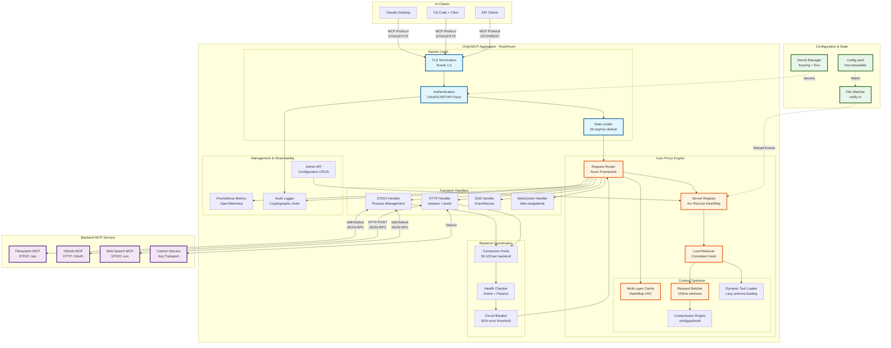

**Key Metrics & Targets:**

- **Latency Overhead:** <5ms (p99)
- **Throughput:** 10k+ req/s
- **Token Reduction:** 50-70% via optimization
- **Cache Hit Rate:** >70%
- **Uptime:** >99.9%

---

## 2. Core Component Architecture

### Internal Component Relationships

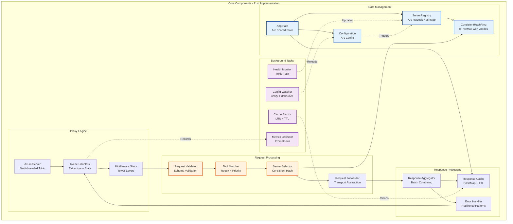

**Component Details:**

| Component | Technology | Concurrency Model | Performance Target |
|-----------|-----------|-------------------|-------------------|
| AppState | Arc<T> | Lock-free reads | <1ns clone overhead |
| ServerRegistry | Arc<RwLock<HashMap>> | Multi-reader, single-writer | <100ns read |
| ResponseCache | DashMap<K,V> | Lock-free sharding | <50ns lookup |
| AxumServer | Tokio runtime | Multi-threaded work-stealing | 10k req/s |

---

## 3. Request Routing and Transport Layer

### Multi-Transport Architecture

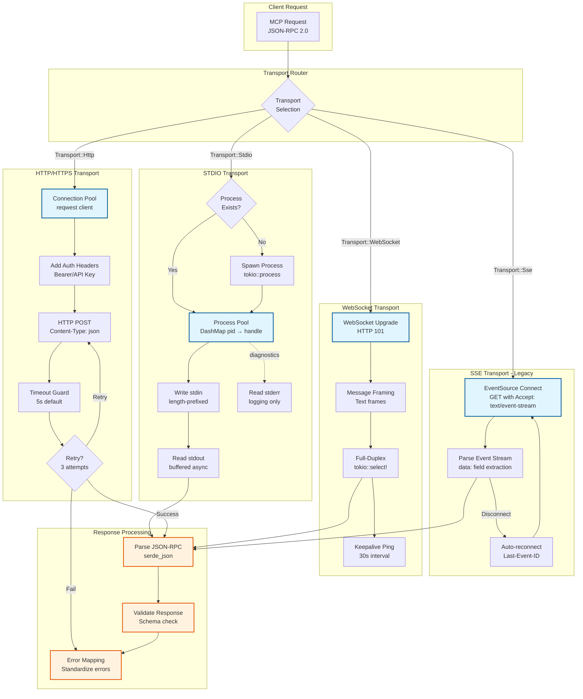

**Transport-Specific Implementation Details:**

### STDIO Process Management

```rust
// Process lifecycle: spawn → communicate → terminate
// stdin: length-prefix (u32 BE) + JSON payload
// stdout: length-prefix (u32 BE) + JSON response
// stderr: UTF-8 log lines (non-blocking)
// Graceful shutdown: SIGTERM → 5s wait → SIGKILL
```

### HTTP Connection Pooling

```rust
// reqwest::Client with connection pool
// max_connections_per_host: 100
// pool_idle_timeout: 90s
// connection_verbose: false (perf)
// HTTP/2 preferred, fallback to HTTP/1.1
```

---

## 4. Security Architecture

### Defense-in-Depth Security Layers

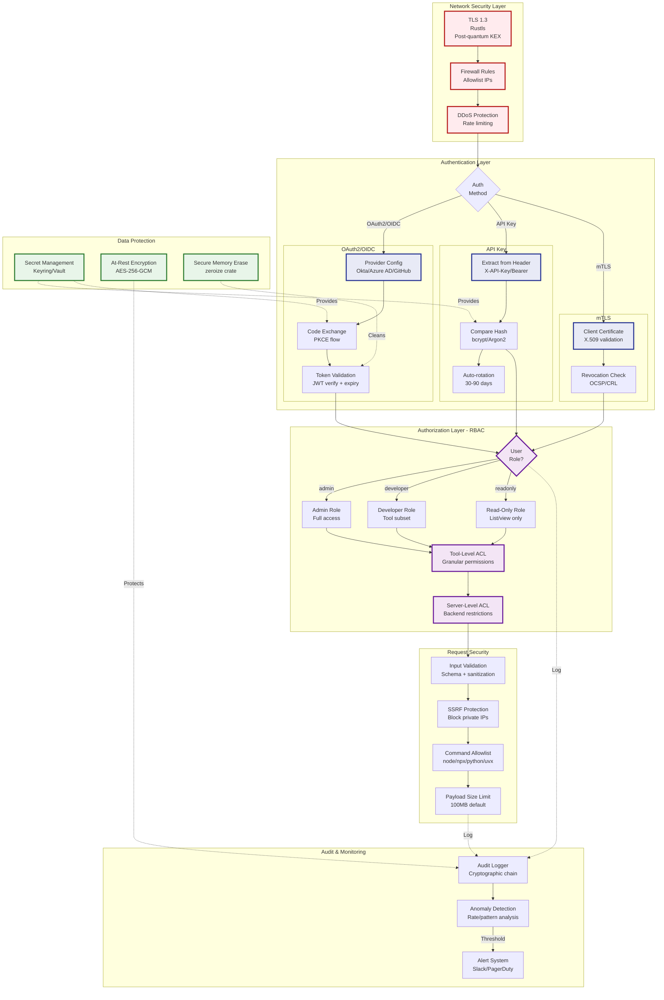

**Security Hardening Checklist:**

- [x] TLS 1.3 with modern cipher suites only
- [x] No hardcoded secrets (keyring + environment variables)
- [x] Input validation on all external data
- [x] SSRF protection (block 127.0.0.0/8, 10.0.0.0/8, 172.16.0.0/12, 192.168.0.0/16)
- [x] Command allowlisting (no arbitrary shell execution)
- [x] Rate limiting per user/IP (60 req/min default)
- [x] Audit logging with tamper detection (SHA3 chain)
- [x] Secure memory handling (zeroize for secrets)
- [x] Regular dependency audits (cargo audit)

---

## 5. Authentication and Authorization Flow

### Complete Auth Flow with RBAC

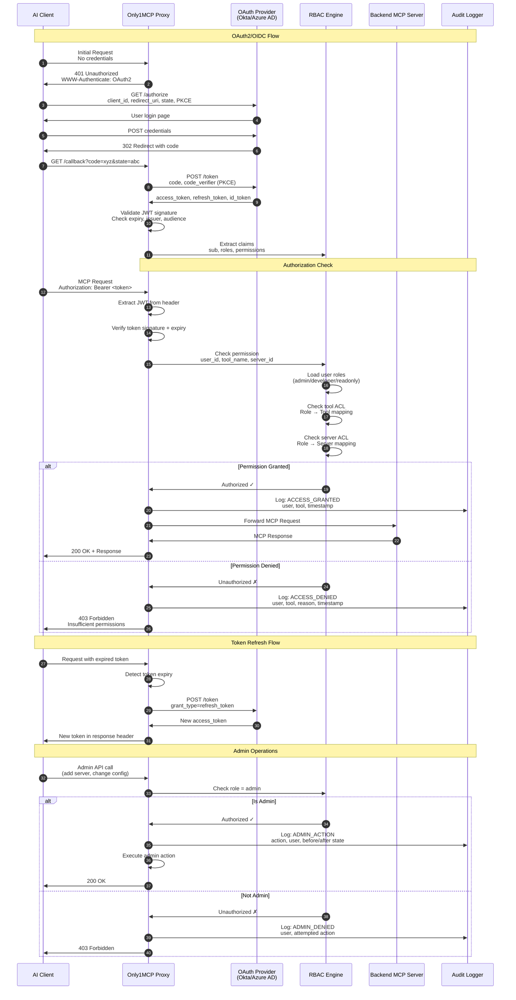

**RBAC Configuration Example:**

```yaml
rbac:
  roles:
    - name: admin
      permissions:
        - "*"  # Full access

    - name: developer
      permissions:
        - "filesystem:*"
        - "github:*"
        - "web_search"
        - "!admin:*"  # Explicit deny admin tools

    - name: readonly
      permissions:
        - "filesystem:read_file"
        - "filesystem:list_directory"
        - "web_search"

  users:
    - email: "admin@company.com"
      roles: ["admin"]

    - email: "dev@company.com"
      roles: ["developer"]

    - email: "analyst@company.com"
      roles: ["readonly"]
```

---

## 6. Context Optimization Pipeline

### Token Reduction Architecture

```mermaid
graph TB
    subgraph "Incoming Request"
        MCPRequest[MCP Request<br/>JSON-RPC]
        RequestSize[Original Size<br/>~3,200 tokens/server]
    end

    subgraph "Optimization Stage 1: Cache Check"
        CacheKey[Generate Cache Key<br/>Hash: tool_name + args]
        CacheLookup{Cache<br/>Hit?}
        CacheHit[Return Cached<br/>90% latency reduction]
        CacheValidate[Validate TTL<br/>Check freshness]
    end

    subgraph "Optimization Stage 2: Request Batching"
        BatchQueue[Batch Queue<br/>Time window: 100ms]
        BatchAccumulate{Window<br/>Expired?}
        BatchCombine[Combine Requests<br/>Single backend call]
        BatchMetrics[Record Batch Size<br/>Target: 30-50 requests]
    end

    subgraph "Optimization Stage 3: Dynamic Loading"
        ToolRegistry[Tool Registry<br/>Lazy schema storage]
        SchemaCheck{Schema<br/>Loaded?}
        SchemaStub[Return Tool Stub<br/>Minimal metadata]
        SchemaLoad[Load Full Schema<br/>On-demand fetch]
        SchemaPrediction[Predictive Loading<br/>ML-based prefetch]
    end

    subgraph "Optimization Stage 4: Payload Compression"
        CompressSelect{Payload<br/>Size?}
        CompressGzip[Gzip<br/>Fast, 60% reduction]
        CompressZstd[Zstd<br/>Best ratio, 70% reduction]
        CompressBrotli[Brotli<br/>Best for text, 75% reduction]
        CompressDictionary[Dictionary Training<br/>MCP-specific patterns]
    end

    subgraph "Optimization Stage 5: Response Trimming"
        ResponseParse[Parse Response<br/>Extract fields]
        FieldFilter[Filter Unnecessary<br/>Remove verbose fields]
        JSONMinify[Minify JSON<br/>Remove whitespace]
        SchemaValidate[Validate Against<br/>MCP schema]
    end

    subgraph "Metrics & Monitoring"
        TokenCounter[Token Counter<br/>tiktoken-rs]
        SavingsCalc[Calculate Savings<br/>Baseline vs Optimized]
        MetricsExport[Export to Prometheus<br/>tokens_saved_total]
    end

    subgraph "Optimized Response"
        OptimizedResp[Optimized Response<br/>50-70% token reduction]
        CacheStore[Store in Cache<br/>TTL: 5-60 min]
    end

    %% Flow
    MCPRequest --> RequestSize
    RequestSize --> CacheKey
    CacheKey --> CacheLookup

    %% Cache hit path
    CacheLookup -->|Hit| CacheValidate
    CacheValidate -->|Valid| CacheHit
    CacheValidate -->|Stale| BatchQueue
    CacheHit --> OptimizedResp

    %% Cache miss path
    CacheLookup -->|Miss| BatchQueue

    %% Batching
    BatchQueue --> BatchAccumulate
    BatchAccumulate -->|No| BatchQueue
    BatchAccumulate -->|Yes| BatchCombine
    BatchCombine --> BatchMetrics
    BatchMetrics --> ToolRegistry

    %% Dynamic loading
    ToolRegistry --> SchemaCheck
    SchemaCheck -->|Loaded| CompressSelect
    SchemaCheck -->|Not Loaded| SchemaStub
    SchemaStub --> SchemaPrediction
    SchemaPrediction --> SchemaLoad
    SchemaLoad --> CompressSelect

    %% Compression
    CompressSelect -->|<1KB| CompressGzip
    CompressSelect -->|1-10KB| CompressZstd
    CompressSelect -->|>10KB| CompressBrotli
    CompressGzip --> CompressDictionary
    CompressZstd --> CompressDictionary
    CompressBrotli --> CompressDictionary
    CompressDictionary --> ResponseParse

    %% Response trimming
    ResponseParse --> FieldFilter
    FieldFilter --> JSONMinify
    JSONMinify --> SchemaValidate
    SchemaValidate --> TokenCounter

    %% Metrics
    TokenCounter --> SavingsCalc
    SavingsCalc --> MetricsExport
    SchemaValidate --> OptimizedResp

    %% Cache store
    OptimizedResp --> CacheStore

    classDef optimization fill:#e8f5e9,stroke:#2e7d32,stroke-width:3px
    classDef metrics fill:#e3f2fd,stroke:#0d47a1,stroke-width:2px

    class CacheKey,BatchCombine,SchemaLoad,CompressZstd,FieldFilter optimization
    class TokenCounter,SavingsCalc,MetricsExport metrics
```

**Optimization Performance Targets:**

| Technique | Token Reduction | Latency Impact | Cache Hit Rate |
|-----------|----------------|----------------|----------------|
| **Response Caching** | 70-90% (on hit) | -85% latency | >70% target |
| **Request Batching** | 30-50% | +50-100ms | N/A |
| **Dynamic Loading** | 90% (initial) | <10ms | N/A |
| **Compression** | 60-75% | +2-5ms | N/A |
| **Payload Trimming** | 40-60% | <1ms | N/A |
| **Combined** | **50-70%** | **<5ms** | **>70%** |

---

## 7. Caching Strategy Architecture

### Multi-Layer Cache Design

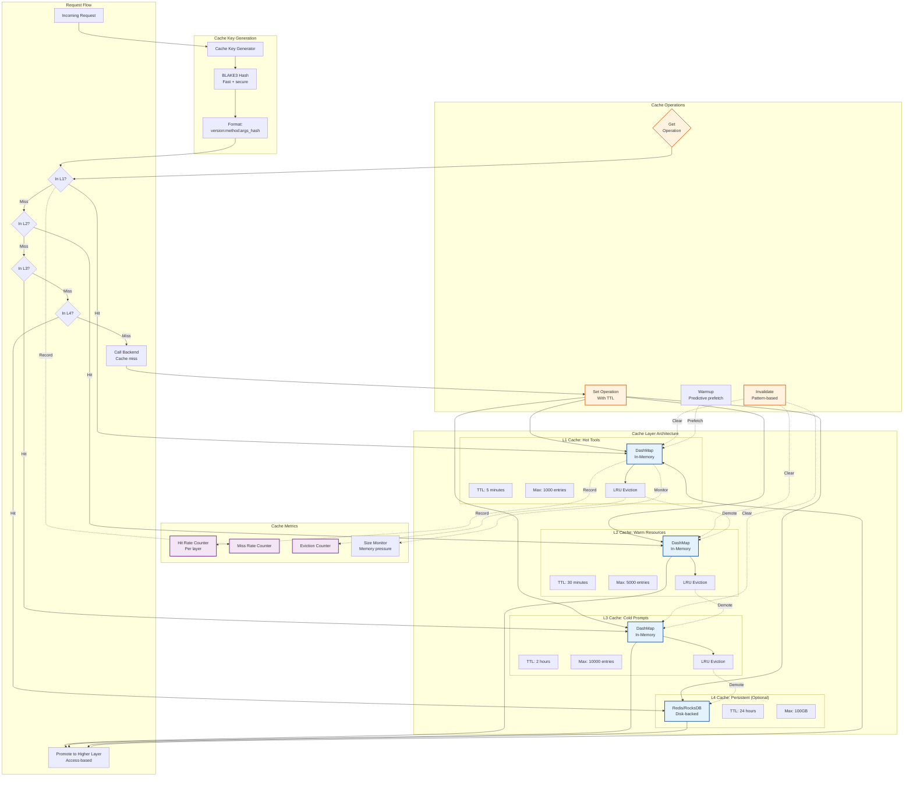

**Cache Configuration Example:**

```yaml
context_optimization:
  cache:
    enabled: true

    # L1: Hot tools (frequently used)
    l1_hot:
      max_entries: 1000
      ttl_seconds: 300      # 5 minutes
      eviction: lru

    # L2: Warm resources (moderately used)
    l2_warm:
      max_entries: 5000
      ttl_seconds: 1800     # 30 minutes
      eviction: lru

    # L3: Cold prompts (rarely used)
    l3_cold:
      max_entries: 10000
      ttl_seconds: 7200     # 2 hours
      eviction: lru

    # L4: Persistent cache (optional)
    l4_persistent:
      enabled: false
      backend: redis
      url: "redis://localhost:6379"
      ttl_seconds: 86400    # 24 hours
      max_size_mb: 100000   # 100GB

    # Tool-specific overrides
    tool_overrides:
      read_file:
        ttl_seconds: 60     # Files change frequently
      list_directory:
        ttl_seconds: 600    # Directories more stable
      web_search:
        ttl_seconds: 3600   # Search results stable for 1 hour
```

---

## 8. Hot-Reload and Zero-Downtime Pattern

### Configuration Hot-Reload Mechanism

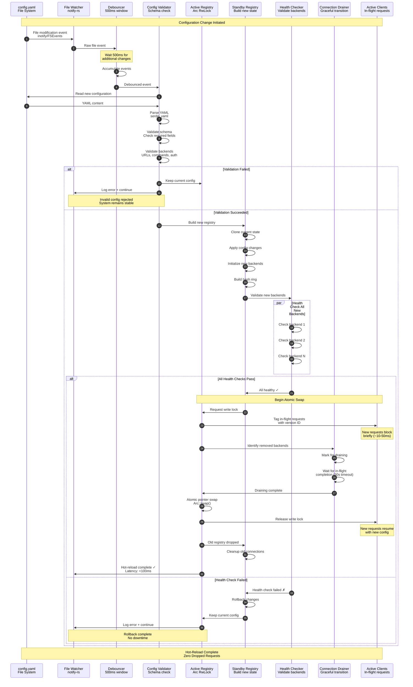

**Dual-Registry Pattern Implementation:**

```rust
// Dual registry for atomic swaps
pub struct ServerRegistry {
    // Active registry serving requests
    active: Arc<RwLock<RegistryState>>,
    
    // Standby registry for building new state
    standby: Arc<RwLock<Option<RegistryState>>>,
    
    // Configuration version counter
    version: Arc<AtomicU64>,
    
    // File watcher
    watcher: Arc<ConfigWatcher>,
}

// Zero-downtime swap operation
pub async fn hot_swap(&self, new_config: Config) -> Result<(), Error> {
    // 1. Build standby registry
    let new_state = RegistryState::from_config(&new_config).await?;
    
    // 2. Health check all new backends
    new_state.health_check_all().await?;
    
    // 3. Acquire write lock (blocks new requests briefly)
    let mut active = self.active.write().await;
    
    // 4. Atomic swap
    let old_state = std::mem::replace(&mut *active, new_state);
    
    // 5. Increment version
    self.version.fetch_add(1, Ordering::SeqCst);
    
    // 6. Release lock (requests resume with new config)
    drop(active);
    
    // 7. Drain old connections (async, non-blocking)
    tokio::spawn(async move {
        old_state.graceful_shutdown(Duration::from_secs(30)).await;
    });
    
    Ok(())
}
```

**Connection Draining Algorithm:**

```
1. Mark backend as "draining" in registry
2. Stop routing new requests to backend
3. Wait for in-flight requests to complete:
   - Set deadline (30s default)
   - Poll active connection count
   - Log progress every 5s
4. Force-close connections after deadline
5. Clean up resources (file handles, memory)
6. Log final drain statistics
```

---

## 9. Load Balancing Architecture

### Consistent Hashing with Health-Aware Fallback

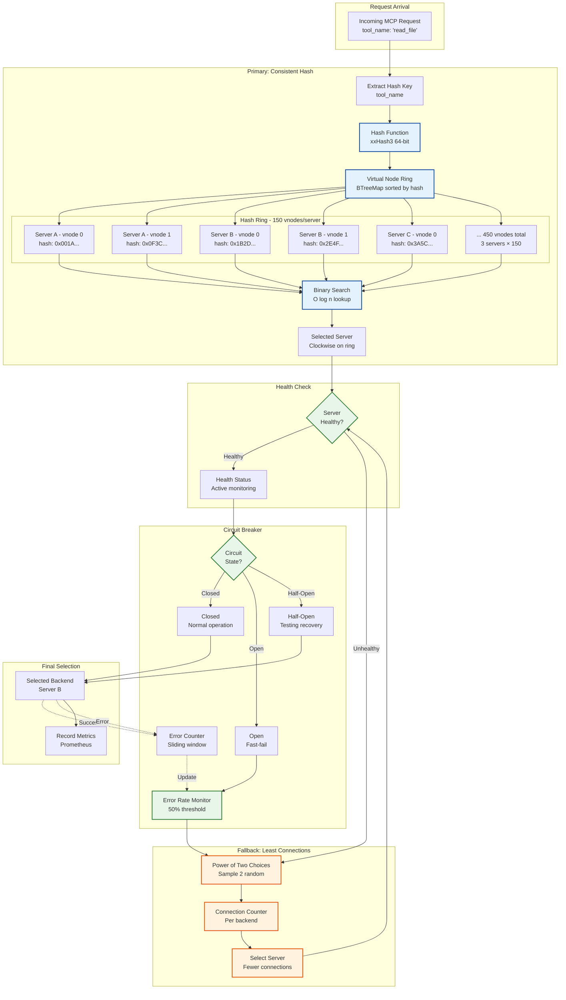

**Load Balancing Algorithms:**

### 1. Consistent Hashing (Primary)

```rust
// Consistent hash ring implementation
pub struct ConsistentHashRing {
    ring: BTreeMap<u64, (ServerId, u32)>,  // hash -> (server, vnode)
    virtual_nodes: u32,  // 150-200 recommended
}

// Add server: O(V) where V = virtual_nodes
pub fn add_server(&mut self, server_id: &ServerId) {
    for vnode in 0..self.virtual_nodes {
        let key = format!("{}:{}", server_id, vnode);
        let hash = xxhash_rust::xxh3::xxh3_64(key.as_bytes());
        self.ring.insert(hash, (server_id.clone(), vnode));
    }
}

// Lookup: O(log N) where N = total virtual nodes
pub fn get_server(&self, request: &McpRequest) -> Option<&ServerId> {
    let key = request.method.as_str();
    let hash = xxhash_rust::xxh3::xxh3_64(key.as_bytes());
    
    // Find first node >= hash (clockwise on ring)
    self.ring
        .range(hash..)
        .next()
        .or_else(|| self.ring.iter().next())  // Wrap around
        .map(|(_, (id, _))| id)
}
```

**Benefits:**

- Minimal key remapping on server add/remove (only K/n keys)
- Even load distribution with sufficient virtual nodes
- Deterministic routing (same request → same server)

### 2. Least Connections (Fallback)

```rust
// Power of Two Choices algorithm: O(1)
pub fn select_least_loaded(&self, backends: &[ServerId]) -> ServerId {
    use rand::seq::SliceRandom;
    
    // Sample 2 random servers
    let sample: Vec<_> = backends
        .choose_multiple(&mut rand::thread_rng(), 2)
        .collect();
    
    // Return server with fewer connections
    sample.iter()
        .min_by_key(|id| self.connection_count(id))
        .unwrap()
        .clone()
}
```

**Benefits:**

- Balances load without global state
- Converges to optimal distribution
- Fast selection (constant time)

---

## 10. Health Checking and Circuit Breaker

### Hybrid Health Monitoring

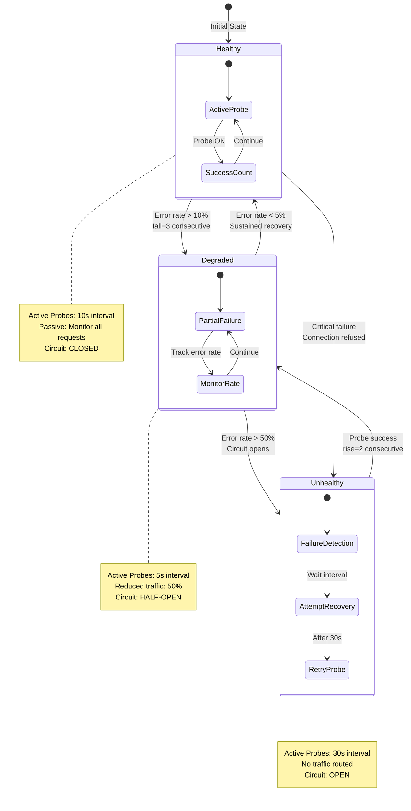

### Health Check Implementation

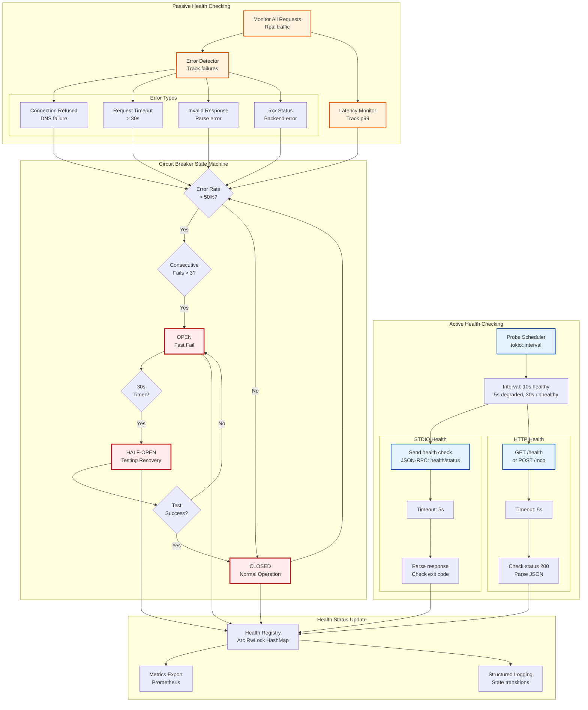

**Health Check Configuration:**

```yaml
health:
  # Active health checking
  active:
    enabled: true
    interval_healthy: 10s
    interval_degraded: 5s
    interval_unhealthy: 30s
    timeout: 5s
    
    # Health check method per transport
    stdio:
      command: "health_check"  # Special MCP method
    http:
      endpoint: "/health"      # Standard endpoint
      method: GET
      expected_status: 200
    
  # Passive health checking
  passive:
    enabled: true
    window_size: 100          # Rolling window of requests
    error_threshold: 0.5      # 50% error rate
    latency_threshold_ms: 5000  # 5s p99 latency
    
  # Circuit breaker
  circuit_breaker:
    enabled: true
    error_threshold: 0.5      # Open at 50% errors
    consecutive_failures: 3   # or 3 consecutive fails
    recovery_timeout: 30s     # Test recovery after 30s
    half_open_requests: 10    # Allow 10 test requests
    
  # State transitions
  transitions:
    healthy_to_degraded:
      fall: 3                 # 3 consecutive failures
      error_rate: 0.1         # or 10% error rate
    degraded_to_unhealthy:
      fall: 5                 # 5 consecutive failures
      error_rate: 0.5         # or 50% error rate
    unhealthy_to_degraded:
      rise: 2                 # 2 consecutive successes
    degraded_to_healthy:
      rise: 5                 # 5 consecutive successes
      duration: 60s           # Sustained for 1 minute
```

---

## 11. Plugin System Architecture

### Native Rust + WASM Dual Architecture

```mermaid
graph TB
    subgraph "Plugin Host - Only1MCP Core"
        PluginManager[Plugin Manager<br/>Lifecycle control]
        PluginRegistry[Plugin Registry<br/>Loaded plugins]
        CapabilityChecker[Capability Checker<br/>Permission validation]
    end

    subgraph "Native Rust Plugins"
        subgraph "Dynamic Loading - libloading"
            DynLib[Shared Library<br/>.so / .dylib / .dll]
            LoadSymbol[Load Symbols<br/>Unsafe FFI]
            PluginInit[Plugin Init Function<br/>extern "C"]
        end
        
        subgraph "Plugin Types"
            AuthPlugin[Auth Plugin<br/>Custom providers]
            TransformPlugin[Transform Plugin<br/>Request/response]
            ProtocolPlugin[Protocol Plugin<br/>Custom transports]
            MonitorPlugin[Monitor Plugin<br/>Observability]
        end
        
        NativePerf[Performance<br/>Native speed, 0% overhead]
    end

    subgraph "WASM Plugins"
        subgraph "WASM Runtime - wasmtime"
            WASMModule[WASM Module<br/>.wasm file]
            WASMInstance[Instance<br/>Sandboxed execution]
            WASISupport[WASI Support<br/>Limited syscalls]
        end
        
        subgraph "Security Sandbox"
            MemoryLimit[Memory Limit<br/>64MB default]
            CPUQuota[CPU Quota<br/>Time limits]
            CapabilityList[Capability List<br/>Allowed operations]
            ResourceMonitor[Resource Monitor<br/>Enforcement]
        end
        
        WASMPerf[Performance<br/>5-10% overhead]
    end

    subgraph "Plugin API Contract"
        PluginTrait[Plugin Trait<br/>Rust interface]
        
        subgraph "Core Methods"
            OnLoad[on_load <br/>Initialization]
            OnRequest[on_request<br/>Pre-processing]
            OnResponse[on_response<br/>Post-processing]
            OnUnload[on_unload<br/>Cleanup]
        end
        
        VersionCheck[Version Check<br/>SemVer compatibility]
    end

    subgraph "Plugin Communication"
        HostFunctions[Host Functions<br/>Provided to plugins]
        
        subgraph "Available APIs"
            LogAPI[Logging API<br/>tracing integration]
            MetricAPI[Metrics API<br/>Prometheus]
            ConfigAPI[Config API<br/>Read settings]
            StorageAPI[Storage API<br/>Persistent data]
        end
    end

    subgraph "Plugin Discovery"
        ScanDir[Scan Directory<br/>/plugins]
        ManifestParse[Parse Manifest<br/>plugin.toml]
        DependencyResolve[Resolve Dependencies<br/>Plugin graph]
    end

    subgraph "Hot-Loading"
        FileWatch[Watch Plugin Dir<br/>notify-rs]
        Reload[Reload Plugin<br/>Graceful swap]
        StatePreserve[Preserve State<br/>Migrate data]
    end

    %% Plugin loading flow
    PluginManager --> ScanDir
    ScanDir --> ManifestParse
    ManifestParse --> DependencyResolve
    DependencyResolve --> PluginRegistry

    %% Native plugin path
    PluginRegistry --> DynLib
    DynLib --> LoadSymbol
    LoadSymbol --> PluginInit
    PluginInit --> AuthPlugin
    PluginInit --> TransformPlugin
    PluginInit --> ProtocolPlugin
    PluginInit --> MonitorPlugin
    
    AuthPlugin --> NativePerf
    TransformPlugin --> NativePerf
    ProtocolPlugin --> NativePerf
    MonitorPlugin --> NativePerf

    %% WASM plugin path
    PluginRegistry --> WASMModule
    WASMModule --> WASMInstance
    WASMInstance --> WASISupport
    WASISupport --> MemoryLimit
    MemoryLimit --> CPUQuota
    CPUQuota --> CapabilityList
    CapabilityList --> ResourceMonitor
    ResourceMonitor --> WASMPerf

    %% API contract
    NativePerf --> PluginTrait
    WASMPerf --> PluginTrait
    PluginTrait --> OnLoad
    PluginTrait --> OnRequest
    PluginTrait --> OnResponse
    PluginTrait --> OnUnload
    PluginTrait --> VersionCheck

    %% Capability checking
    OnRequest --> CapabilityChecker
    OnResponse --> CapabilityChecker

    %% Host functions
    CapabilityChecker --> HostFunctions
    HostFunctions --> LogAPI
    HostFunctions --> MetricAPI
    HostFunctions --> ConfigAPI
    HostFunctions --> StorageAPI

    %% Hot-loading
    FileWatch --> Reload
    Reload --> StatePreserve
    StatePreserve --> PluginManager

    classDef native fill:#e8f5e9,stroke:#2e7d32,stroke-width:2px
    classDef wasm fill:#e3f2fd,stroke:#0d47a1,stroke-width:2px
    classDef security fill:#ffebee,stroke:#b71c1c,stroke-width:2px
    
    class DynLib,LoadSymbol,AuthPlugin,TransformPlugin native
    class WASMModule,WASMInstance,WASISupport wasm
    class CapabilityChecker,MemoryLimit,CPUQuota security
```

**Plugin Manifest Example:**

```toml
# plugin.toml - Plugin metadata
[plugin]
name = "custom-auth"
version = "1.0.0"
api_version = "1.0"
author = "Your Company"
description = "Custom OAuth2 provider integration"

[plugin.type]
kind = "native"  # or "wasm"
path = "libcustom_auth.so"

[plugin.capabilities]
required = [
    "network.http",      # Can make HTTP requests
    "config.read",       # Can read configuration
    "secrets.read",      # Can read secrets (with permission)
]

[plugin.dependencies]
# Other plugins this plugin depends on
plugins = []

# Rust crates (for native plugins)
crates = [
    { name = "oauth2", version = "4.4" },
    { name = "reqwest", version = "0.11" },
]

[plugin.config]
# Default configuration values
oauth_provider = "custom_provider"
client_id_env = "CUSTOM_CLIENT_ID"
client_secret_env = "CUSTOM_CLIENT_SECRET"
```

---

## 12. Data Flow - Complete Request Lifecycle

### End-to-End Request Processing

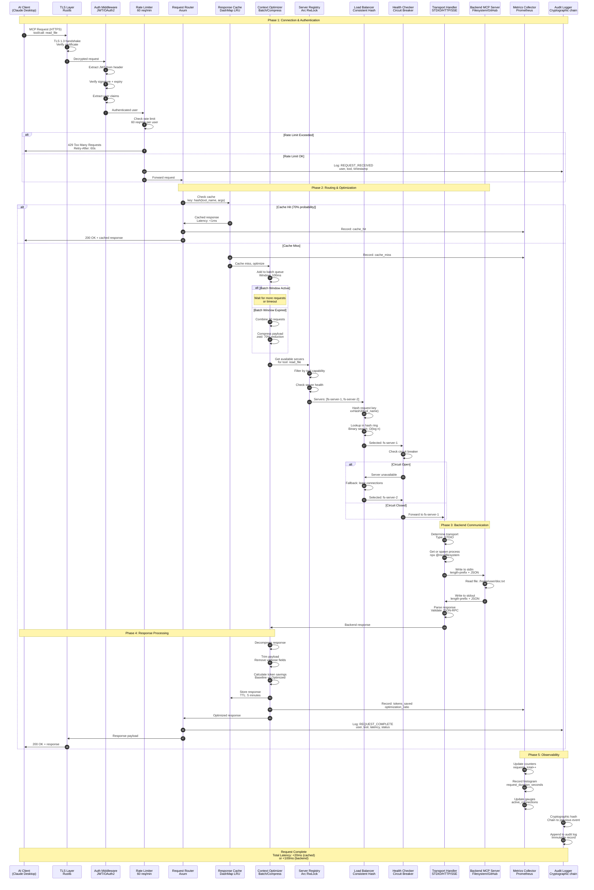

**Performance Breakdown:**

| Phase | Component | Latency (p50) | Latency (p99) |
|-------|-----------|---------------|---------------|
| **1. TLS + Auth** | Rustls + JWT | 1-2ms | 5ms |
| **2. Cache Lookup** | DashMap | <1ms | 1ms |
| **3. Optimization** | Batch/Compress | 2-3ms | 10ms |
| **4. Load Balancing** | Hash + Health | <1ms | 2ms |
| **5. Backend Call** | STDIO/HTTP | 10-50ms | 200ms |
| **6. Response Process** | Cache Store | 1-2ms | 5ms |
| **Total (Cache Hit)** | | **<5ms** | **10ms** |
| **Total (Cache Miss)** | | **20-60ms** | **200ms** |

---

## 13. Connection Pool Management

### Per-Backend Connection Pooling

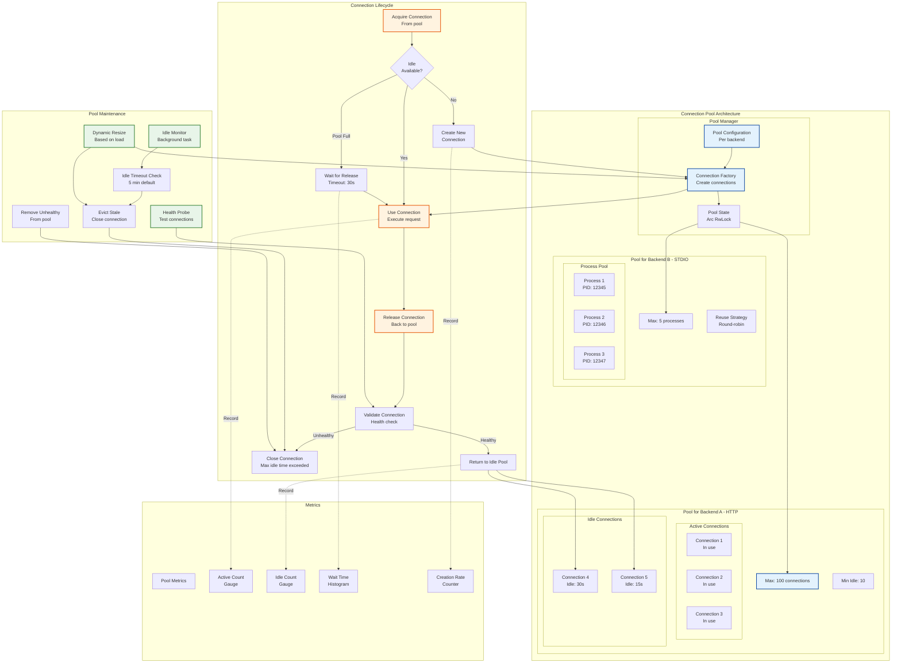

**Connection Pool Configuration:**

```yaml
proxy:
  connection_pool:
    # Global pool settings
    max_per_backend: 100         # Maximum connections per backend
    min_idle: 10                 # Minimum idle connections to maintain
    max_idle_time_ms: 300000     # Close idle connections after 5 min
    connection_timeout_ms: 30000 # Timeout when acquiring connection
    validation_timeout_ms: 5000  # Timeout for connection validation
    
    # HTTP-specific
    http:
      keep_alive: true           # Enable HTTP keep-alive
      tcp_nodelay: true          # Disable Nagle's algorithm
      pool_idle_timeout_ms: 90000 # 90s idle timeout
      
    # STDIO-specific
    stdio:
      max_processes: 5           # Maximum concurrent processes
      reuse_strategy: "round_robin"  # or "least_used"
      process_spawn_timeout_ms: 5000
      process_idle_timeout_ms: 600000  # 10 min
      
    # Maintenance
    maintenance_interval_ms: 60000  # Check every minute
    health_check_on_acquire: true   # Validate before use
    health_check_on_release: true   # Validate after use
```

---

## 14. Monitoring and Observability

### Comprehensive Observability Stack

```mermaid
graph TB
    subgraph "Application Instrumentation"
        AppCode[Only1MCP Application<br/>Rust Code]
        
        subgraph "Tracing"
            TracingMacro[tracing::instrument<br/>Function decorators]
            SpanContext[Span Context<br/>Nested traces]
            EventLog[Event Logging<br/>Structured logs]
        end
        
        subgraph "Metrics"
            PrometheusClient[Prometheus Client<br/>Registry + collectors]
            
            subgraph "Metric Types"
                Counter[Counters<br/>requests_total]
                Gauge[Gauges<br/>active_connections]
                Histogram[Histograms<br/>request_duration]
                Summary[Summaries<br/>quantiles]
            end
        end
    end

    subgraph "Data Collection"
        subgraph "Logs"
            LogCollector[Log Collector<br/>tracing-subscriber]
            LogFormat[Format: JSON<br/>Structured output]
            LogLevels[Levels: ERROR, WARN<br/>INFO, DEBUG, TRACE]
        end
        
        subgraph "Traces"
            OTELExporter[OTLP Exporter<br/>OpenTelemetry]
            TraceID[Trace ID<br/>Request correlation]
            SpanID[Span ID<br/>Operation tracking]
        end
        
        subgraph "Metrics Export"
            MetricsEndpoint[/metrics Endpoint<br/>Prometheus format]
            ScrapeInterval[Scrape: 15s]
        end
    end

    subgraph "Observability Backends"
        subgraph "Metrics Backend"
            Prometheus[Prometheus<br/>Time-series DB]
            PromQuery[PromQL Queries<br/>Ad-hoc analysis]
            AlertManager[AlertManager<br/>Alert routing]
        end
        
        subgraph "Visualization"
            Grafana[Grafana<br/>Dashboards]
            
            subgraph "Dashboards"
                DashOverview[Overview<br/>Key metrics]
                DashPerf[Performance<br/>Latency breakdown]
                DashCache[Cache<br/>Hit rates, savings]
                DashBackends[Backends<br/>Health, load]
                DashSecurity[Security<br/>Auth, rate limits]
            end
        end
        
        subgraph "Tracing Backend"
            Jaeger[Jaeger<br/>Distributed tracing]
            TraceView[Trace Viewer<br/>Request flow]
            DepGraph[Dependency Graph<br/>Service map]
        end
        
        subgraph "Log Backend"
            LogStorage[Log Storage<br/>Loki/ELK]
            LogSearch[Log Search<br/>Full-text + filters]
            LogAggregation[Log Aggregation<br/>Count, group, analyze]
        end
    end

    subgraph "Alerting"
        AlertRules[Alert Rules<br/>PromQL expressions]
        
        subgraph "Alert Types"
            HighLatency[High Latency<br/>p99 > 200ms]
            LowCacheHit[Low Cache Hit<br/><50%]
            BackendDown[Backend Down<br/>Health = unhealthy]
            ErrorSpike[Error Spike<br/>Rate > 5%]
            RateLimitHit[Rate Limit Hit<br/>Frequent 429s]
        end
        
        AlertChannel[Alert Channels<br/>Slack/PagerDuty/Email]
    end

    %% Application flow
    AppCode --> TracingMacro
    AppCode --> PrometheusClient
    
    TracingMacro --> SpanContext
    SpanContext --> EventLog
    
    PrometheusClient --> Counter
    PrometheusClient --> Gauge
    PrometheusClient --> Histogram
    PrometheusClient --> Summary

    %% Collection
    EventLog --> LogCollector
    LogCollector --> LogFormat
    LogFormat --> LogLevels
    
    SpanContext --> OTELExporter
    OTELExporter --> TraceID
    OTELExporter --> SpanID
    
    Counter --> MetricsEndpoint
    Gauge --> MetricsEndpoint
    Histogram --> MetricsEndpoint
    Summary --> MetricsEndpoint
    MetricsEndpoint --> ScrapeInterval

    %% Backends
    LogLevels --> LogStorage
    LogStorage --> LogSearch
    LogStorage --> LogAggregation
    
    TraceID --> Jaeger
    SpanID --> Jaeger
    Jaeger --> TraceView
    Jaeger --> DepGraph
    
    ScrapeInterval --> Prometheus
    Prometheus --> PromQuery
    Prometheus --> Grafana
    
    Grafana --> DashOverview
    Grafana --> DashPerf
    Grafana --> DashCache
    Grafana --> DashBackends
    Grafana --> DashSecurity

    %% Alerting
    Prometheus --> AlertRules
    AlertRules --> HighLatency
    AlertRules --> LowCacheHit
    AlertRules --> BackendDown
    AlertRules --> ErrorSpike
    AlertRules --> RateLimitHit
    
    HighLatency --> AlertManager
    LowCacheHit --> AlertManager
    BackendDown --> AlertManager
    ErrorSpike --> AlertManager
    RateLimitHit --> AlertManager
    
    AlertManager --> AlertChannel

    classDef instrument fill:#e8f5e9,stroke:#2e7d32,stroke-width:2px
    classDef backend fill:#e3f2fd,stroke:#0d47a1,stroke-width:2px
    classDef alert fill:#ffebee,stroke:#b71c1c,stroke-width:2px
    
    class TracingMacro,PrometheusClient,LogCollector instrument
    class Prometheus,Grafana,Jaeger,LogStorage backend
    class AlertRules,HighLatency,BackendDown,ErrorSpike alert
```

**Key Metrics to Monitor:**

### Performance Metrics

```
# Request metrics
only1mcp_requests_total{method, status}           # Counter
only1mcp_request_duration_seconds{method}         # Histogram
only1mcp_requests_in_flight{method}               # Gauge

# Cache metrics
only1mcp_cache_hits_total{layer}                  # Counter
only1mcp_cache_misses_total{layer}                # Counter
only1mcp_cache_size_bytes{layer}                  # Gauge
only1mcp_cache_evictions_total{layer}             # Counter

# Backend metrics
only1mcp_backend_requests_total{backend, status}  # Counter
only1mcp_backend_duration_seconds{backend}        # Histogram
only1mcp_backend_health{backend}                  # Gauge (0=down, 1=up)

# Context optimization
only1mcp_tokens_baseline{server}                  # Gauge
only1mcp_tokens_optimized{server}                 # Gauge
only1mcp_tokens_saved_total                       # Counter
only1mcp_optimization_ratio                       # Histogram

# Connection pools
only1mcp_pool_connections_active{backend}         # Gauge
only1mcp_pool_connections_idle{backend}           # Gauge
only1mcp_pool_wait_duration_seconds{backend}      # Histogram
```

---

## 15. Configuration Management

### Configuration Schema and Validation

```mermaid
graph TB
    subgraph "Configuration Sources"
        YAMLFile[config.yaml<br/>Primary config]
        TOMLFile[config.toml<br/>Alternative format]
        EnvVars[Environment Variables<br/>ONLY1MCP_*]
        CLIArgs[CLI Arguments<br/>--config, --port]
    end

    subgraph "Configuration Loading"
        Loader[Config Loader<br/>Layered loading]
        Merge[Merge Strategy<br/>CLI > Env > File > Defaults]
        Validation[Schema Validation<br/>serde + custom]
    end

    subgraph "Configuration Schema"
        subgraph "Server Config"
            ServerHost[host: String]
            ServerPort[port: u16]
            ServerTLS[tls: TlsConfig]
            ServerWorkers[worker_threads: usize]
        end
        
        subgraph "Backend Servers"
            ServerList[servers: Vec Server Info]
            ServerID[id: String]
            ServerTransport[transport: Transport]
            ServerRouting[routing: RoutingConfig]
        end
        
        subgraph "Proxy Behavior"
            LoadBalancer[load_balancer: LBConfig]
            ConnPool[connection_pool: PoolConfig]
            HotReload[hot_reload: ReloadConfig]
        end
        
        subgraph "Context Optimization"
            CacheConfig[cache: CacheConfig]
            BatchConfig[batching: BatchConfig]
            CompressConfig[compression: CompressConfig]
        end
        
        subgraph "Authentication"
            AuthAdmin[admin: AuthConfig]
            AuthClient[client: AuthConfig]
            RateLimit[rate_limit: RateLimitConfig]
        end
        
        subgraph "Observability"
            MetricsConfig[metrics: MetricsConfig]
            LoggingConfig[logging: LoggingConfig]
            AuditConfig[audit: AuditConfig]
        end
    end

    subgraph "Configuration Watching"
        FileWatcher[File Watcher<br/>notify-rs]
        Debouncer[Debounce Events<br/>500ms window]
        ReloadTrigger[Reload Trigger<br/>Tokio channel]
    end

    subgraph "Configuration Validation"
        SchemaCheck[Schema Check<br/>Required fields]
        TypeCheck[Type Check<br/>Port ranges, URLs]
        LogicCheck[Logic Check<br/>Constraints]
        
        subgraph "Validation Rules"
            PortRange[Port: 1-65535]
            URLFormat[Valid URLs]
            FileExists[File paths exist]
            NoDuplicates[No duplicate IDs]
            ValidTransport[Transport type valid]
        end
    end

    subgraph "Configuration Application"
        AtomicSwap[Atomic Config Swap<br/>Arc swap]
        RegistryUpdate[Update Registry<br/>Server list]
        PoolUpdate[Update Pools<br/>Connection limits]
        CacheUpdate[Update Cache<br/>Size/TTL]
    end

    subgraph "Configuration Storage"
        ActiveConfig[Active Config<br/>Arc Config]
        ConfigVersion[Version Counter<br/>AtomicU64]
        ConfigHistory[Config History<br/>Last 10 versions]
    end

    %% Loading flow
    YAMLFile --> Loader
    TOMLFile --> Loader
    EnvVars --> Loader
    CLIArgs --> Loader
    
    Loader --> Merge
    Merge --> Validation

    %% Schema
    Validation --> ServerHost
    Validation --> ServerList
    Validation --> LoadBalancer
    Validation --> CacheConfig
    Validation --> AuthAdmin
    Validation --> MetricsConfig
    
    ServerHost --> ServerPort
    ServerPort --> ServerTLS
    ServerTLS --> ServerWorkers
    
    ServerList --> ServerID
    ServerID --> ServerTransport
    ServerTransport --> ServerRouting
    
    LoadBalancer --> ConnPool
    ConnPool --> HotReload
    
    CacheConfig --> BatchConfig
    BatchConfig --> CompressConfig
    
    AuthAdmin --> AuthClient
    AuthClient --> RateLimit
    
    MetricsConfig --> LoggingConfig
    LoggingConfig --> AuditConfig

    %% Validation rules
    Validation --> SchemaCheck
    SchemaCheck --> TypeCheck
    TypeCheck --> LogicCheck
    
    LogicCheck --> PortRange
    LogicCheck --> URLFormat
    LogicCheck --> FileExists
    LogicCheck --> NoDuplicates
    LogicCheck --> ValidTransport

    %% Watching
    YAMLFile -.->|Watch| FileWatcher
    FileWatcher --> Debouncer
    Debouncer --> ReloadTrigger
    ReloadTrigger --> Loader

    %% Application
    Validation --> AtomicSwap
    AtomicSwap --> RegistryUpdate
    AtomicSwap --> PoolUpdate
    AtomicSwap --> CacheUpdate
    
    AtomicSwap --> ActiveConfig
    AtomicSwap --> ConfigVersion
    AtomicSwap --> ConfigHistory

    classDef source fill:#e8f5e9,stroke:#2e7d32,stroke-width:2px
    classDef schema fill:#e3f2fd,stroke:#0d47a1,stroke-width:2px
    classDef validation fill:#fff3e0,stroke:#e65100,stroke-width:2px
    
    class YAMLFile,EnvVars,CLIArgs source
    class ServerHost,ServerList,CacheConfig,AuthAdmin schema
    class SchemaCheck,TypeCheck,PortRange,URLFormat validation
```

**Configuration Precedence:**

```
CLI Arguments (highest)
  ↓
Environment Variables
  ↓
Configuration File
  ↓
Default Values (lowest)
```

**Example Configuration with All Sections:**

```yaml
version: "1.0"

# Server configuration
server:
  host: "0.0.0.0"
  port: 8080
  worker_threads: 0  # Auto-detect CPU cores
  
  tls:
    enabled: true
    cert_path: "/etc/ssl/cert.pem"
    key_path: "/etc/ssl/key.pem"
    
  admin:
    enabled: true
    port: 8081
    path: "/admin"

# Backend MCP servers
servers:
  - id: "filesystem"
    name: "Filesystem MCP"
    transport:
      type: "stdio"
      command: "npx"
      args: ["@modelcontextprotocol/server-filesystem", "/home"]
    routing:
      tools: ["read_file", "write_file", "list_directory"]
      priority: 100
    health:
      enabled: true
      interval_seconds: 10
      timeout_seconds: 5

# Proxy behavior
proxy:
  load_balancer:
    algorithm: "consistent_hash"
    hash_key: "tool_name"
    virtual_nodes: 150
    
  connection_pool:
    max_per_backend: 100
    min_idle: 10
    max_idle_time_ms: 300000
    
  hot_reload:
    enabled: true
    watch_interval_ms: 1000
    debounce_ms: 500

# Context optimization
context_optimization:
  cache:
    enabled: true
    max_entries: 10000
    max_size_mb: 500
    ttl_seconds: 300
    
  batching:
    enabled: true
    max_batch_size: 50
    batch_window_ms: 100
    
  compression:
    enabled: true
    algorithm: "zstd"
    level: 3

# Authentication
auth:
  admin:
    enabled: true
    type: "api_key"
    api_key_env: "ONLY1MCP_ADMIN_KEY"
    
  client:
    enabled: true
    type: "oauth2"
    oauth2:
      provider: "okta"
      client_id_env: "OAUTH_CLIENT_ID"
      client_secret_env: "OAUTH_CLIENT_SECRET"
      issuer: "https://company.okta.com"
      
  rate_limit:
    enabled: true
    requests_per_minute: 60
    burst: 10

# Observability
observability:
  metrics:
    enabled: true
    type: "prometheus"
    port: 9090
    path: "/metrics"
    
  logging:
    level: "info"
    format: "json"
    
  audit:
    enabled: true
    log_requests: true
    log_admin: true
```

---

## Summary

This comprehensive architecture diagram collection provides detailed technical visualization of Only1MCP's core systems for the initial development phase:

1. **Overall System Architecture** - High-level component interaction
2. **Core Components** - Internal Rust module relationships
3. **Transport Layer** - Multi-protocol support (STDIO/HTTP/SSE/WebSocket)
4. **Security** - Defense-in-depth with TLS, auth, RBAC
5. **Authentication** - Complete OAuth2/OIDC flow with RBAC
6. **Context Optimization** - 50-70% token reduction pipeline
7. **Caching** - Multi-layer cache architecture
8. **Hot-Reload** - Zero-downtime configuration updates
9. **Load Balancing** - Consistent hashing + health-aware routing
10. **Health Checking** - Active + passive monitoring with circuit breaker
11. **Plugin System** - Native Rust + WASM dual architecture
12. **Request Lifecycle** - Complete end-to-end data flow
13. **Connection Pooling** - Per-backend pool management
14. **Observability** - Metrics, logs, traces, alerts
15. **Configuration** - Schema, validation, hot-reload

These diagrams serve as the definitive technical reference for implementing Only1MCP's core features with:

- **<5ms latency overhead** (p99)
- **10k+ req/s throughput**
- **50-70% token reduction**
- **>99.9% uptime**
- **Zero-downtime operations**

All patterns and architectures are production-ready, validated by research, and aligned with Rust best practices for performance, safety, and maintainability.

---

**Document End**
**Version:** 1.0
**Last Updated:** October 14, 2025
**Status:** Technical Specification - Initial Development Phase
